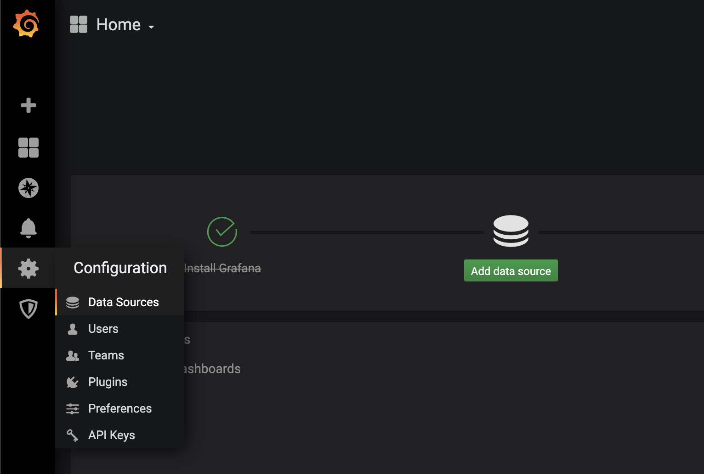
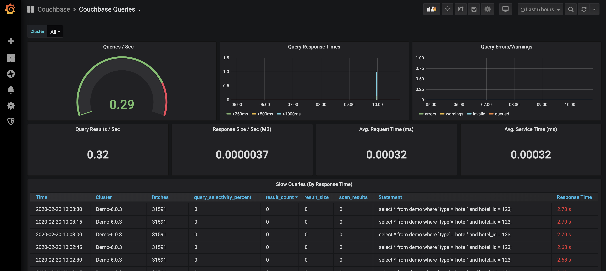

---
# frontmatter
path: "/tutorial-configure-grafana"
title: Configuring Grafana
short_title: Configure Grafana
description: 
  - Learn how to add Prometheus as a data source for Grafana
  - Import various sample dashboards, then learn how to build your own by exploring the Grafana Documentation
content_type: tutorial
filter: observability
technology: 
  - server
tags:
  - Prometheus
  - Monitoring
  - Observability
  - Configuration
sdk_language:
  - any
length: 15 Mins
---

## Add Grafana Data Source

Open the Grafana UI

```bash
http://<grafana-ip>:3000
```

Add a datasource by going to Configuration -> Data Sources. 



Click the "Add data source" button

Select "Prometheus"

Set the name to `Prometheus` (note this is case-sensitive).

In the URL, enter `http://<prometheus-ip>:9090`, leave the rest of the defaults and click "Save & Test".

## Import Grafana Dashboards

Dashboards provide different ways of visualizing your data. Find [sample dashboards for Prometheus and Grafana](https://github.com/couchbaselabs/cbprometheus_python/tree/master/grafana). Review the documentation for more information on [creating your own dashboards and panels for Grafana](https://grafana.com/docs/grafana/latest/features/panels/panels/).

Click the + sign on the left-hand side of the UI, and choose "Import".

Copy the contents from [Couchbase Queries-1581449916780.json](https://raw.githubusercontent.com/couchbaselabs/cbprometheus_python/master/grafana/Couchbase%20Queries-1581449916780.json) and paste them into the textbox.

Click the "Load" button

This will populate the name of the Dashboard automatically. Since this is the first Dashboard being created, click on the Folder dropdown, and choose "--New Folder--". Type "Couchbase" for the folder name and click "Create".

Click the "Import" button

You should see a dashboard similar to the following:



Repeat this process for any other existing dashboards that you want to visualize and start creating your own custom dashboards.
