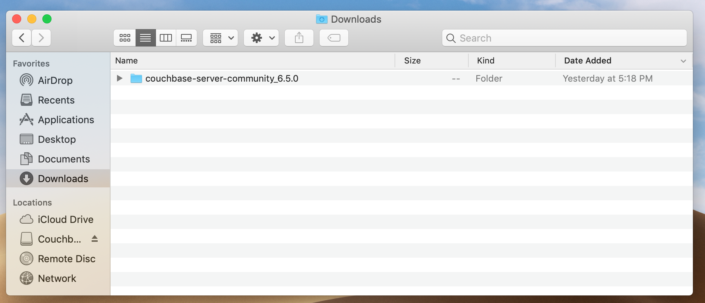
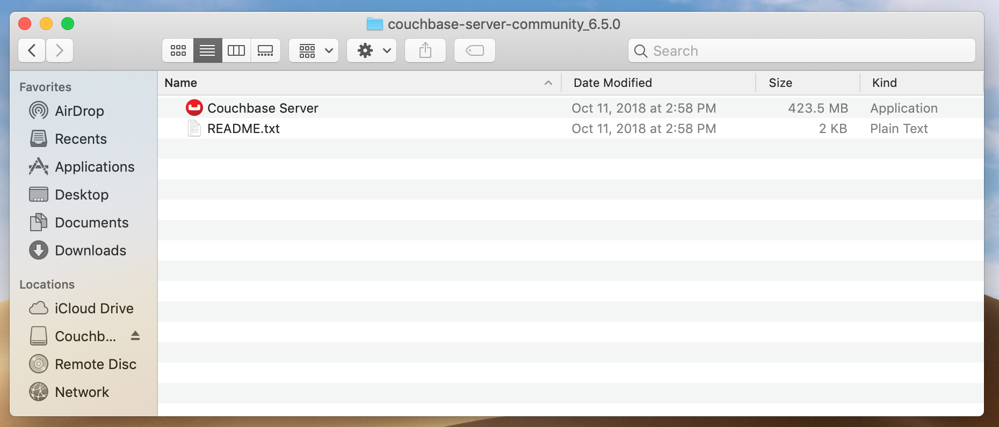
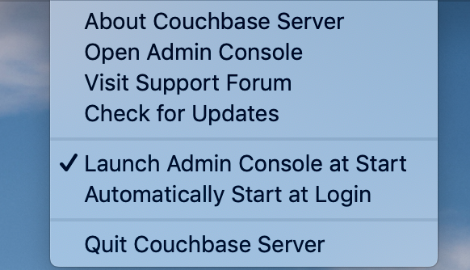
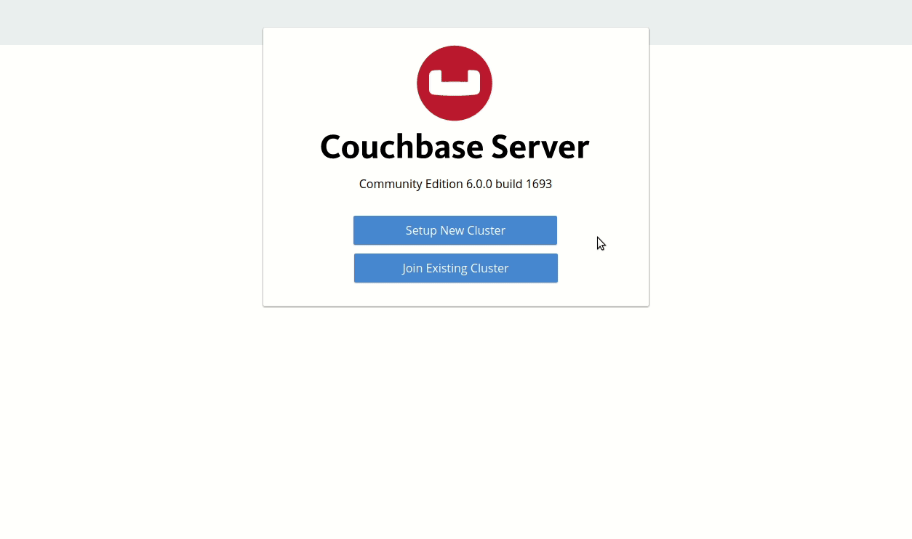

---
# frontmatter
path: "/tutorial-getting-started-with-couchbase-ce"
title: Installing and Operating Couchbase Server Community Edition (CE)
short_title: Get Started with Community Edition
description: 
  - Learn how to install and operate Couchbase Server Community Edition (CE)
  - Compare installations across various platforms and find the method that fits your development needs
content_type: tutorial
filter: other
technology:
  - server
tags:
  - Community Edition
  - Configuration
sdk_language:
  - any
length: 30 Mins
---

This tutorial was built using the [Community Edition(CE)](https://docs.couchbase.com/server/current/introduction/editions.html) of Couchbase Server, so you can use this distribution to follow this guide free of charge.

[Couchbase Server](https://www.couchbase.com/products/server) is an integrated document database and key-value store with a distributed architecture for performance, scalability, and availability. It enables developers to build applications easier and faster by leveraging the power of `SQL` with the flexibility of `JSON`.

For additional questions and feedback, please check tagged questions on [Stack Overflow](https://stackoverflow.com/questions/tagged/couchbase) or the [Couchbase Forums](https://forums.couchbase.com).

## Installation

> Tested for `Ubuntu 18.04`, `macOS Mojave` and `Windows 10`.

You can install the server in your machine (bare metal) or use a containerization tool such as `Docker`, to speed up this part of the tutorial.

## Docker

This would be the fastest and easiest way to get the server started. If you need help installing `Docker`, their official documentation contains [installation guides](https://docs.docker.com/install/) for multiple operating systems.

After `Docker` is up and running you can type this command on your terminal to launch the server.

```bash
docker run -itd --name couchbase-server -p 8091-8094:8091-8094 -p 11210:11210 couchbase:community
```

For a more extensive install guide, you can check the Couchbase image description on [Dockerhub](https://hub.docker.com/_/couchbase)

## Bare Metal

### Ubuntu 18.04

First, open your terminal and install these tools, used by some of the core `Couchbase Server` packages.

```bash
sudo apt update
sudo apt install curl lsb-release gnupg
```

Download and install the `.deb` meta-package, it contains the necessary information for `apt` to retrieve Couchbase's necessary packages and public signing keys.

```bash
curl -O https://packages.couchbase.com/releases/6.5.0/couchbase-server-community_6.5.0-ubuntu18.04_amd64.deb
sudo dpkg -i ./couchbase-server-community_6.5.0-ubuntu18.04_amd64.deb
```

Now you are ready to install the `Couchbase Server CE` latest release.

```bash
sudo apt update
sudo apt install couchbase-server-community
```

> For a more extensive install guide, you can follow the Couchbase documentation for [Ubuntu 18.04](https://docs.couchbase.com/server/current/install/ubuntu-debian-install.html)

### Windows 10

Download the `MSI` installer from this [link](https://www.couchbase.com/downloads/thankyou/community?product=couchbase-server&version=6.5.0&platform=windows&addon=false&beta=false)

Execute it and follow the wizard.


> For a more extensive install guide, you can follow the Couchbase documentation for [Windows 10](https://docs.couchbase.com/server/current/install/install-package-windows.html).

### macOS

Download the `zip` file from this [link](https://www.couchbase.com/downloads/thankyou/community?product=couchbase-server&version=7.0.0&platform=osx&addon=false&beta=false) and open it, it will be send to `Downloads` folder.



Open the folder and drag the application to you `Applications` folder.



Double click the `Couchbase Server` application to start the server.


You can now use the navigation tab icon on the top right corner of your desktop to manage your server.




> For a more extensive install guide, you can follow the Couchbase documentation for [macOS](https://docs.couchbase.com/server/current/install/macos-install.html).

## Initialization

The server starts automatically after installation but you can manage this behavior, as shown [here](https://docs.couchbase.com/server/current/install/startup-shutdown.html).

If everything went well during installation, when you open up your browser on **`localhost:8091`** you should see the Couchbase Server Web Console.


The next step will be to configure your server, so click on `Setup New Cluster`.

Choose a server name and an administrator with a password, these credentials must be saved for later use.

Now press `Finish With Defaults`, this should be enough to follow our tutorial. If you wish to better configure the server, up to your particular needs, follow this [link](https://docs.couchbase.com/server/current/manage/manage-nodes/create-cluster.html#configure-couchbase-server).



You now have a functional `Couchbase Server CE`.

### Next Steps

We recommend you to follow our next tutorials, go to the [tutorials](/tutorials) page to find more resources.

Also, visit the [Couchbase Documentation](https://docs.couchbase.com/home/index.html) to learn more about all sorts of topics.
