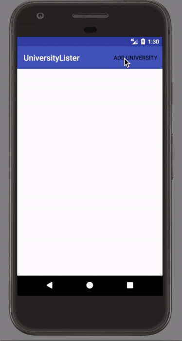
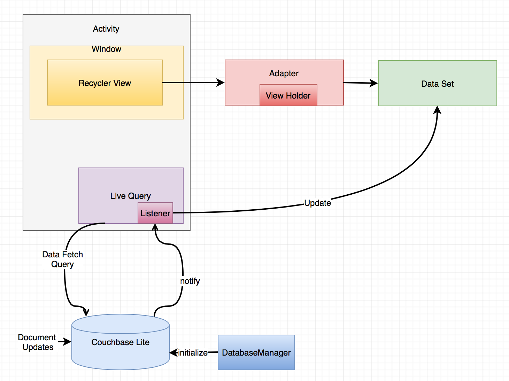

---
# frontmatter
path: "/tutorial-cblite-android-java-recyclerviews"
title: Tutorial Couchbase Lite with Recycler Views in Android with Java
short_title: Android Recycler Views
description: 
  - Build an Android App in Java with Couchbase Lite and Recycler Views
  - Learn how Couchbase Lite can act as an embedded, standalone ata store for your mobile application
  - Explore benefits of the RecyclerView widget on Android
content_type: tutorial
filter: mobile
technology: 
  - mobile
  - query
landing_page: none 
landing_order: 14 
tags:
  - Android
sdk_language:
  - android-java
length: 30 Mins
---

## Introduction

The [RecyclerView](https://developer.android.com/reference/android/support/v7/widget/RecyclerView.html) widget is a popular option on the [Android](https://developer.android.com) platform for efficiently displaying dynamic data collections.
The data items feeding the RecyclerView may change as a result of user's actions or with data fetched from the network.
As the name indicates, RecyclerViews _recycle_ the views that correspond to the items in the data sets.

This tutorial will demonstrate how you can use

* [Couchbase Lite 2.0](https://developer.couchbase.com/documentation/mobile/2.0/whatsnew.html) as a data source for RecyclerViews in your Android application.

In this tutorial, we will be using [Couchbase Lite](https://developer.couchbase.com/documentation/mobile/2.0/couchbase-lite/index.html) as a standalone, embedded data store within your mobile app.

You can learn more about Couchbase Mobile [here](https://developer.couchbase.com/mobile)

## Prerequisites

* Android Studio 2.3 +
  * Latest Version Downloadable from [Android Developer Site](https://developer.android.com/studio/)

* git (Optional) ßThis is required if you would prefer to pull the source code from GitHub repo.
  * Create a [free github account](https://github.com) if you don't already have one
  * git can be downloaded from [git-scm.org](https://git-scm.com/book/en/v2/Getting-Started-Installing-Git)

* Familiarity with the fundamentals of using Couchbase Lite on Android. If you need refresher, refer to our [Getting Started with Android Java Guide](https://developer.couchbase.com/documentation/mobile/2.0/couchbase-lite/java.html).

* Familiarity with the basics of [Android app development apps](https://developer.android.com) and with  [RecyclerViews](https://developer.android.com/guide/topics/ui/layout/recyclerview).

## Installation

You have two options to download the App Source Code

### Option 1 : Git Clone

* Clone the **_master_** branch of the `UniversityLister` project from GitHub. Type the following command in your terminal

```shell
  git clone https://github.com/couchbaselabs/UniversityLister-Android.git
```

### Option 2 : Download .zip

* Download the  `UniversityLister` project from [here](https://github.com/couchbaselabs/UniversityLister-Android/archive/master.zip)

## App Overview

We will be working with a very simple "University Lister" app.

The app does the following:

* It displays a list of "university" items in a `Recyclerview` with `Couchbase Lite` as the data source.
* Every time a "University" entry is added to the Couchbase Lite database, the RecyclerView displaying the university items is automatically updated to include the newly added item



## Try It Out

* Build and run the app in Android Studio.
* Tap on the "ADD UNIVERSITY" button.
* This will result in a new university item getting added to the RecyclerView.

Now let's see how this works.

## App Design

A typical design pattern for using Couchbase Lite as the data source for the RecyclerView in your app is shown below.

This also corresponds to the way we have implemented it in the sample app.



Here are the key elements:

* The _RecyclerView_ is instantiated by the [_Activity_](https://developer.android.com/reference/android/app/Activity) and contains the _Adapter_ .

* The [_Adapter_](https://developer.android.com/reference/android/widget/Adapter) is responsible for binding the data items to the view using the [__ViewHolder pattern__](https://developer.android.com/reference/android/support/v7/widget/RecyclerView.ViewHolder).

* _Couchbase Lite_ is the data source for the data items that is used for populating the views.

* The _Database Manager_ which is a singleton class is used for initialization and management of Couchbase Lite.

* [The Couchbase Lite Query](https://developer.couchbase.com/documentation/mobile/2.0/guides/couchbase-lite/native-api/query/index.html#live-query) API for interacting with the database.

A Couchbase Lite Live Query allows an app to register for changes to the database that affect the results of the query using the `addChangeListener` call.

This is the sequence

* The Activity uses the Couchbase Lite Live Query to query for data items in the database and a listener is registered to handle query data updates.
* Every time the database gets updated with data that affects the query results, the Activity is notified of the changes via the listener callback.
* After retrieving the data from the Couchbase Lite database, the Adapter is notified of the changes.
* The RecyclerView is then updated with the updated data set.

*NOTE*: _How_ the data gets into Couchbase Lite is not important in the context of this tutorial. In a real world app, the data in Couchbase Lite may be fetched from a remote server or may be updated as a result of the local user's action. In our app, we manually insert a randomly created University document by clicking on the "ADD UNIVERSITY" button.

## Initialization

* Open the *ListActivity.java* file and locate the `onCreate` method. This is where all the initialization takes place.

```java
@Override
protected void onCreate(Bundle savedInstanceState) {
    super.onCreate(savedInstanceState);

    // Initialize couchbase lite database manager
    dbMgr = new DatabaseManager(this); // <1>

    // Set content layout
    setContentView(R.layout.activity_list); // <2>


    // Set toolbar
    Toolbar toolbar = (Toolbar) findViewById(R.id.university_toolbar);
    setSupportActionBar(toolbar);

    // Get recycler view
    RecyclerView recyclerView = (RecyclerView)findViewById(R.id.rvUniversities);
    recyclerView.setAdapter(adapter); // <3>
    recyclerView.setLayoutManager(new LinearLayoutManager(this)); 

    // Asynchronously Load the data from local sample file
    DataFetcher fetcher = new DataFetcher(this,this); //<4>
    fetcher.execute();
}
```

<1> The `DatabaseManager` is instantiated. This is a singleton class that is responsible for creating/opening instance of Couchbase Lite
<2> The typical content layout initialization is handled here
<3> The `RecyclerView` is configured with the `UniversityListAdapter` adapter and the appropriate Layout Manager.
<4> The `DataFetcher` is instantiated. The DataFetcher is an android `AsyncTask` that is responsible for loading sample university data from a file bundled with the app. Think of it as simulating an external source for the data. We invoke the `execute()` method on the AsyncTask. More on this in the next section.

## Loading Sample Data

* Open the **DataFetcher.java** file and locate the `doInBackground()` function, during Activity Launch, the `DataFetcher` class loads the sample university data from a local file bundled with the app. The loading of data is done on a background thread using `AsyncTask`.

```java
@Override
protected List<University> doInBackground(Void... voids) {
    String fileName = "university_sample.txt";
    StringBuilder stringBuilder = new StringBuilder();
    List<University> universities = null;
    try {
        // Load data from local sample data file
        InputStream inputStream = mContext.getAssets().open(fileName); //<1>
        // use Jackson library to map the JSON to List of University POJO
        ObjectMapper mapper = new ObjectMapper().configure(DeserializationFeature.FAIL_ON_UNKNOWN_PROPERTIES, false); //<2>
        universities = Arrays.asList(mapper.readValue(inputStream, University[].class));
        return universities;
    } catch (IOException  e ) {
        e.printStackTrace();
        return null;
    }
}

@Override
protected void onPostExecute(List<University> result) {
    // Notify the IDataFetchResponse delegate (which in this case is ListActivity) of the availability of data
    mDelegate.postResult(result);
}
```

1. The sample data is loaded from the _university-sample.txt_ file in the assets folder. The content is in JSON format.
2. Once the data is read, The JSON data is mapped to corresponding `University` POJO objects using the [Jackson library](https://github.com/FasterXML/jackson).
3. `ListActivity` is then  notified of the completion of data load via the `IDataFetchResponse` interface.

**Note**: The sample data is _not_ saved into the Couchbase Lite database at this point. It is in an in-memory data structure called `sampleData` in the `ListActivity` class. We will see how this sample data is used a little later in the tutorial.

## Loading Data from Couchbase Lite And Notifying the Adapter

* Open the **ListActivity.java** file and locate to the `QueryForListOfUniversities()` method. This Activity sets up a "Live Query" to fetch the list of universities from the Couchbase Lite database. Initially, it will be empty.

```java
private void QueryForListOfUniversities() {
    try {
        // Create a liveQuery to fetch all documents from database
        query = QueryBuilder.
                select(SelectResult.all()).
                from(DataSource.database(dbMgr.database)); //<1>

        // Add a live query listener to continually monitor for changes
        query.addChangeListener(new QueryChangeListener() { //<2>
                @Override
                    public void changed(QueryChange change) {
                        ResultSet resultRows = change.getResults();
                        Result row;
                        List<University> universities = new ArrayList<University>();
                        // Iterate over changed rows, corresponding documents and map to University POJO
                        while ((row = resultRows.next()) != null) { //<3>
                            ObjectMapper objectMapper = new ObjectMapper();
                            // Ignore undeclared properties
                            objectMapper.configure(DeserializationFeature.FAIL_ON_UNKNOWN_PROPERTIES, false);


                            // Get dictionary value
                            Dictionary valueMap = row.getDictionary(dbMgr.database.getName()); //<4>

                            // Convert from dictionary to corresponding University object
                            University university = objectMapper.convertValue(valueMap.toMap(),University.class);
                            universities.add(university); //<5>
                        }

                        // Update the adapter with the newly added University documents
                        adapter.setUniversities(universities); //<6>

                        runOnUiThread(new Runnable() {
                            @Override
                            public void run() {
                                // 5. Notify adapter of changed data
                                adapter.notifyDataSetChanged(); //<7>
                            }
                        });

                    }
                }
        );
        // Run Query 
        query.execute(); //<8>
    }
    catch (IllegalArgumentException e) {

    } catch (CouchbaseLiteException e) {
        e.printStackTrace();
    }
}
```

* A Query is created ising the [Query API](http://docs.couchbase.com/mobile/2.0/couchbase-lite-java/) to fetch all documents from Couchbase Lite database. Typically you will use a `where` clause to filter the subset of documents to be fetched. But in our case, the database only holds the university documents so we just retrieve all of it.

* A query change listener is registered to listen to all database changes that impact the query. This makes the query "live". As documents are added to the Couchbase Lite database, the activity will be asynchronously notified of the additions.
* In the listener callback, iterate over result set
* For every result, get the  `ReadOnlyDictionary` object correponding to the entry
* Convert from `ReadOnlyDictionary` type to University POJO using the `ObjectMapper` (from Jackson library)
* Update the adapter with the changed documents
* Notify the adapter of the updated data set that will cause the RecyclerView to be reloaded with the updated data
* Run the Query

## Saving to Couchbase Lite and Triggering Database Change Updates

In the &lt;Loading Sample Data&gt; section, we discussed how to load the sample university data  into an in-memory `sampleData` List data. This was intended to simulate the loading of data from an external source, like a web service for instance or a local user's action.  Now, we discuss when and how that data is used.

* Open the **ListActivity.java** file and locate the `fetchUniversityAndAddToDatabase()` method. The `fetchUniversityAndAddToDatabase()` method is invoked when the user taps on the "ADD UNIVERSITY" button in the app. In this method, we insert a data item from the sample data into Couchbase Lite.

```java
private void fetchUniversityAndAddToDatabase() {
    Random r = new Random();
    int index = r.nextInt(sampleData.size()-1);
    try {
        // Get university object at randomly selected index
        University university = sampleData.get(index); //<1>

        // Construct the document from university object
        ObjectMapper objectMapper = new ObjectMapper(); <2>

        // Ignore undeclared properties
        objectMapper.configure(DeserializationFeature.FAIL_ON_UNKNOWN_PROPERTIES, false);

        HashMap<String,Object> universityMap = objectMapper.convertValue(university,HashMap.class);
        MutableDocument doc = new MutableDocument(universityMap);

        // Save document to database.
        dbMgr.database.save(doc); //<3>
    }
    catch ( CouchbaseLiteException | NullPointerException e) {
        e.printStackTrace();
    }
}
```

* A random entry from the `sampleData` List of `University` objects is selected
* The `Universty` object is converted to Couchbase Lite `Document` using the `ObjectMapper` class of Jackson library
* The `Document` is inserted into the database. This insertion triggers the Query listener to be invoked.

## Learn More

Congratulations on completing this tutorial!

This tutorial walked you through an example of how to use Couchbase Lite database as an embedded data source for RecyclerViews within your Android app. We looked at a simple Query example. Check out the following links for further details on the Query API

## Further Reading

* [Java API Reference](http://docs.couchbase.com/mobile/2.0/couchbase-lite-java/)
* [Getting Started with Couchbase Lite on Android](https://developer.couchbase.com/documentation/mobile/2.0/couchbase-lite/java.html)
* [Fundamentals of the Couchbase Lite 2.0 Query API](https://blog.couchbase.com/sql-for-json-query-interface-couchbase-mobile/)
* [Handling Arrays in Queries](https://blog.couchbase.com/querying-array-collections-couchbase-mobile/)
* [Couchbase Lite 2.0 Full Text Search API](https://blog.couchbase.com/full-text-search-couchbase-mobile-2-0/)
* [Couchbase Lite 2.0 JOIN Query](https://blog.couchbase.com/join-queries-couchbase-mobile/)
