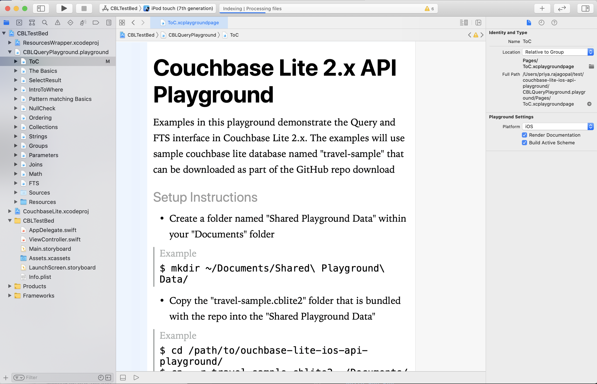
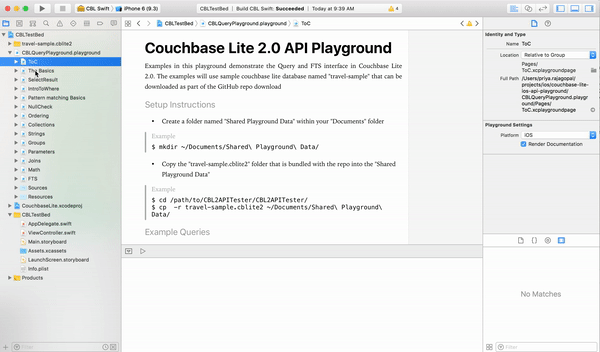

---
# frontmatter
path: "/tutorial-xcode-playground-swift"
title: 'XCode Playground: Exploring Couchbase Lite Query API' 
short_title: Couchbase Lite and XCode
description: 
  - Use Swift Playgrounds to explore and get familiar with the Couchbase Lite Query API
  - Get a brief introduction to Swift Playgrounds and learn how you can use them to explore different facets of iOS development
  - View a video of the tutorial
content_type: tutorial
filter: mobile
technology: 
  - mobile
  - query
landing_page: none 
landing_order: 16 
tags:
  - iOS
  - Xcode
sdk_language:
  - swift
length: 30 Mins
---

## Introduction

The [Xcode Playground](https://developer.apple.com/swift/#playgrounds-repl) can be used to test out the key capabilities of [Query](https://docs.couchbase.com/couchbase-lite/current/swift/learn/swift-query.html) interface in Couchbase Lite 2.x.

While the Xcode playground demonstrates the queries in swift, given the unified nature of the QueryBuilder API across the various Couchbase Lite platforms, barring language specific idioms, you should be able to map the queries to any of the other platform languages supported in Couchbase Lite.

So, even if you are not a Swift developer, you should be able to leverage the Xcode playground for API exploration. This tutorial makes no assumptions about your familiarity with Swift or iOS Development so even if you are a complete newbie to iOS development, you should be able to follow along this step-by-step guide.

## Prerequisites

- iOS (Swift)
- Xcode 12+
- Swift 5.1+

## Installation

- Clone the repo from GitHub by running the following command from the terminal

```bash
  git clone https://github.com/couchbaselabs/couchbase-lite-ios-api-playground
```

- We will use [Carthage](https://github.com/Carthage/Carthage) to download and install CouchbaseLite. If you do not have Carthage, please follow instructions [here](https://github.com/Carthage/Carthage#installing-carthage) to install Carthage on your MacOS

- Switch to folder containing the Cartfile

```bash
  cd /path/to/couchbase-lite-ios-api-playground/carthage 
```

- Download Couchbase Lite using Carthage . The version of Couchbase Lite used is specified in the Cartfile

```bash
  carthage update --platform ios --no-build
```

## Exploring the Project

- Open the `CBLQueryTestBed.xcworkspace` using Xcode12 or above.

```bash
  cd /path/to/couchbase-lite-ios
  
  open CBLQueryTestBed.xcworkspace/
  
```

- You should see a bunch of playground pages in your project explorer. Start with the "ToC" page.
- Check Render Documentation checkbox in the Utilities Window to turn on rendering of the playground pages



- From the "ToC" page, you can navigate to any of the other playground pages. Each playground page exercises a set of queries against the "travel-sample.cblite" database

## Build and Run

- Navigate to playground page that you want to run
- Select the *CBLTestBed* scheme with simulator target. This _must_ be the active scheme
- Do a clean of build  using *Cmd-Shift-K*. You may have to do that for every page
- Run the playground. This will automatically build the dependent frameworks. Be patient- this will take a minute or so to build

**TROUBLESHOOTING TIPS**:

- Supporting third party frameworks within xcode playgrounds is quite glitchy and it could take couple of build attempts to resolve the dependencies. If you see an error about "Couldn't lookup symbols", just re-run the playground



## Learn More

Congratulations on completing this tutorial!

This tutorial walked you through the steps to set up an Xcode playground for testing   the Query API in Couchbase Lite 2.x. As a next step, try expanding the playground to include additional queries against a different dataset . Check out the following links for further details on the Query API including a Xcode playground for testing the APIs.

### Further Reading

- [Fundamentals of the Couchbase Lite 2.0 Query API](https://blog.couchbase.com/sql-for-json-query-interface-couchbase-mobile/)
- [Handling Arrays in Queries](https://blog.couchbase.com/querying-array-collections-couchbase-mobile/)
- [Couchbase Lite 2.0 Full Text Search API](https://blog.couchbase.com/full-text-search-couchbase-mobile-2-0/)
- [Couchbase Lite 2.0 JOIN Query](https://blog.couchbase.com/join-queries-couchbase-mobile/)

## Demo

You can watch a video recording of this tutorial [here](https://youtu.be/9NA2OXdSiqA)
