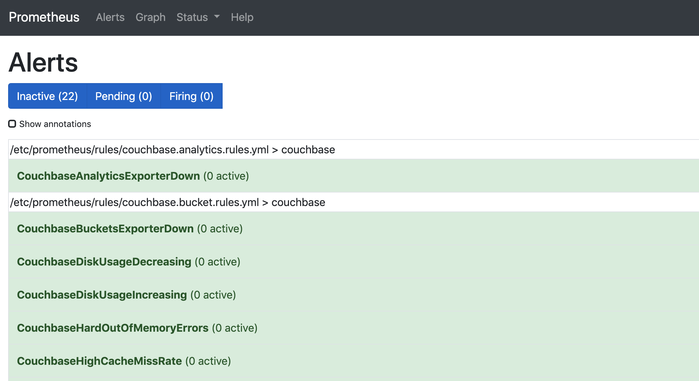

---
# frontmatter
path: "/tutorial-configure-prometheus-alerts"
title: Configure Prometheus Alerts
short_title: Configure Prometheus Alerts
description: 
  - Learn how to create and configure rules to send effective alerts
  - Work with our example rules to get an understanding of how rules work, then write rules that are custom-tailored to your application
  - See your rules in action with the Prometheus UI
content_type: tutorial
filter: observability
technology:
  - server
tags:
  - Prometheus
  - Monitoring
  - Observability
  - Configuration
sdk_language:
  - any
length: 15 Mins
---

## Configure Prometheus to use AlertManager

Edit the `prometheus.yml` file from the server that Prometheus is installed on and add the following YAML below the `global:` block and before the `scrape_configs:` block.

```bash
sudo vi /etc/prometheus/prometheus.yml
```

```yaml
# Alertmanager configuration
alerting:
  alertmanagers:
  - static_configs:
    - targets:
      - <alertmanager-ip>:9093
    scheme: http
    timeout: 10s
```

## Configure Prometheus to Monitor AlertManager

Edit the `prometheus.yml` file and add the following under the `scrape_configs:` block.

```bash
sudo vi /etc/prometheus/prometheus.yml
```

```yaml
  - job_name: alertmanager
    honor_labels: true
    honor_timestamps: true
    scheme: http
    scrape_interval: 60s
    scrape_timeout: 55s
    metrics_path: /metrics
    static_configs:
    - targets: ['localhost:9093']
```

Restart Prometheus

```bash
sudo systemctl restart prometheus
```

## Create Prometheus Rules

Create a rules directory for Prometheus to reference.

```bash
sudo mkdir -p /etc/prometheus/rules
```

Copy all of the example rules into the directory:

```bash
sudo cp /opt/couchbase_exporter/prometheus/rules/*.yml /etc/prometheus/rules
```

Set the permissions so that the prometheus user is the owner.

```bash
sudo chown -R prometheus:prometheus /etc/prometheus/rules
```

Verify that all of the rules are valid by using `promtool`

```bash
promtool check rules /etc/prometheus/rules/*.yml
```

The output should show SUCCESS for all rules files, similar to the following:

```bash
Checking /etc/prometheus/rules/couchbase.analytics.rules.yml
  SUCCESS: 2 rules found

Checking /etc/prometheus/rules/couchbase.bucket.rules.yml
  SUCCESS: 10 rules found

Checking /etc/prometheus/rules/couchbase.eventing.rules.yml
  SUCCESS: 2 rules found

Checking /etc/prometheus/rules/couchbase.fts.rules.yml
  SUCCESS: 2 rules found

Checking /etc/prometheus/rules/couchbase.index.rules.yml
  SUCCESS: 2 rules found

Checking /etc/prometheus/rules/couchbase.query.rules.yml
  SUCCESS: 4 rules found

Checking /etc/prometheus/rules/couchbase.system.rules.yml
  SUCCESS: 4 rules found

Checking /etc/prometheus/rules/couchbase.xdcr.rules.yml
  SUCCESS: 4 rules found
```

## Configure Prometheus Rules

The rules files exist, now prometheus needs to be configured to use them. Add the following YAML after the `alerting:` block and before the `scrape_configs:` block.

```yaml
# Load rules once and periodically evaluate them according
# to the global evaluation_interval.
rule_files:
  - "rules/couchbase.*.rules.yml"
```

```bash
sudo vi /etc/prometheus/prometheus.yml
```

Validate the configuration changes using `promtool`

```bash
promtool check config /etc/prometheus/prometheus.yml
```

Restart Prometheus so the configuration change is picked up.

```bash
sudo systemctl restart prometheus
```

## Access Prometheus UI

Open the Prometheus UI and go to the "Alerts" tab.

```bash
http://<prometheus-ip>:9090/alerts
```

You should be able to see all of the configured alerts in the UI.



**Disclaimer:** The rules that have been provided are for example purposes only. Alerts should be configured and tailored specific to your use-case and environments. Please review the documentation for [adding your own custom Prometheus alerting rules](https://prometheus.io/docs/prometheus/latest/configuration/alerting_rules/).
