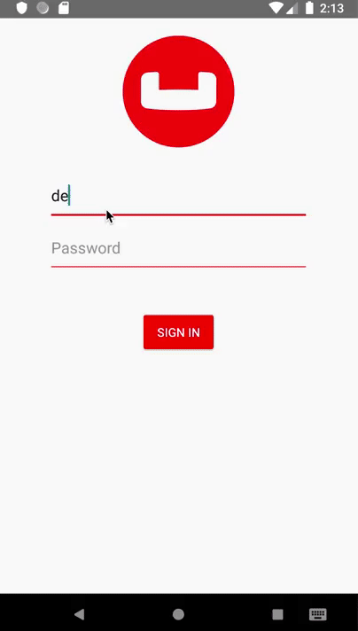
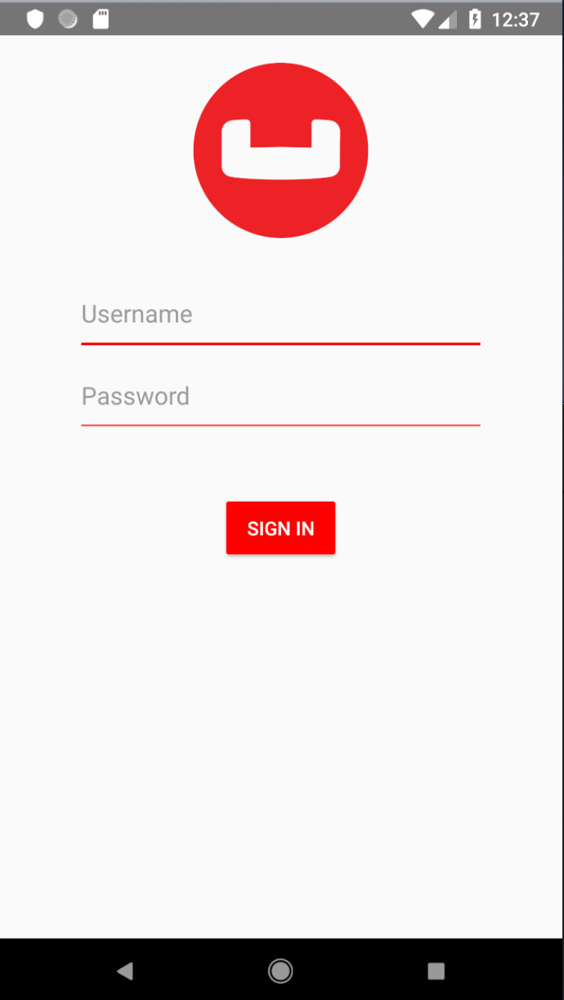
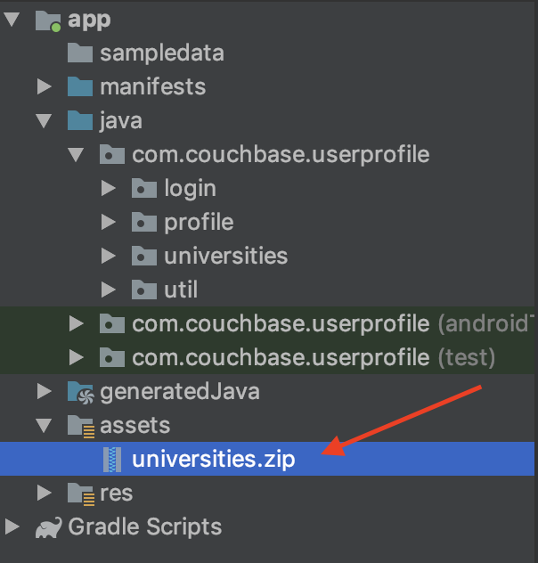
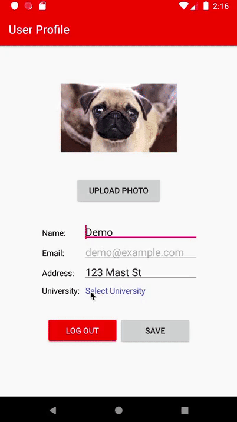
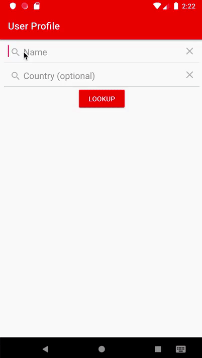
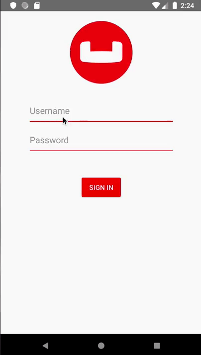

---
# frontmatter
path: "/tutorial-quickstart-android-java-query"
title: Quickstart in Couchbase Lite Query with Android and Java  
short_title: Couchbase Lite Query
description: 
  - Build an Android App in Java and Couchbase Lite using Query
  - Learn the basics of the QueryBuilder interface
  - See how you can bundle, load, and use a prebuilt instance of Couchbase Lite
content_type: quickstart
filter: mobile
technology: 
  - mobile
  - query
  - fts
landing_page: mobile
landing_order: 5
tags:
  - Android
sdk_language:
  - android-java
length: 30 Mins
---

## Introduction

Couchbase Lite brings powerful querying and Full-Text-Search(FTS) capabilties to the edge. The new query interface is based on <a target="_blank" rel="noopener noreferrer" href="https://www.couchbase.com/products/n1ql">N1QL</a>, Couchbase’s declarative query language that extends <a target="_blank" rel="noopener noreferrer" href="https://www.sqlite.org/index.html">SQL</a> for JSON. If you are familiar with SQL, you will feel right at home with the semantics of the new API.  The query API is designed using the <a target="_blank" rel="noopener noreferrer" href="https://en.wikipedia.org/wiki/Fluent_interface">Fluent API Design Pattern</a>, and it uses method cascading to read to like a Domain Specific Language (DSL). This makes the interface very intuitive and easy to understand.

Couchbase Lite can be used as a standalone embedded database within your mobile app.

This tutorial will walk through a simple Android app that will

* Demonstrate how you can bundle, load, and use a  **_prebuilt_** instance of Couchbase Lite
* Introduce you to the basics of the `QueryBuilder` interface

You can learn more about Couchbase Mobile <a target="_blank" rel="noopener noreferrer" href="https://developer.couchbase.com/mobile">here</a>.

## Prerequisites

This tutorial assumes familiarity with building <a target="_blank" rel="noopener noreferrer" href="https://www.android.com/">Android</a> apps using <a target="_blank" rel="noopener noreferrer" href="https://openjdk.java.net/">Java</a> and with the basics of Couchbase Lite.

* If you are unfamiliar with the basics of Couchbase Lite, it is recommended that you walk through the <a target="_blank" rel="noopener noreferrer" href="https://developer.couchbase.com/tutorial-quickstart-android-java-basic/">Quickstart in Couchbase Lite with Android and Java Tutorial</a> on using Couchbase Lite as a standalone database.

* <a target="_blank" rel="noopener noreferrer" href="https://developer.android.com/studio">Android Studio Artic Fox (2020.3.1) or above</a>
* Android SDK installed and setup (v.31)
* Android Build Tools (> v.31)
* Android device or emulator running API level 22 or above
* JDK 8 (now embedded into Android Studio Artic Fox)

## App Overview

We will be working with a very simple "User Profile" app. If you had walked through the <a target="_blank" rel="noopener noreferrer" href="https://developer.couchbase.com/tutorial-quickstart-android-java-basic/">Quickstart in Couchbase Lite with Android and Java Tutorial</a>, you would quickly realize that this version extends the functionality introduced in the version introduced in that tutorial.

This app does the following

* Allows users to log in and create or update his/her user profile information. You could do that in the <a target="_blank" rel="noopener noreferrer" href="https://developer.couchbase.com/tutorial-quickstart-android-java-basic/">Quickstart in Couchbase Lite with Android and Java Tutorial</a>.

* As part of profile information, users can now selecting a `University` from a list of possible options.

The list of matching universities is queried (using the new Query API) from a local *prebuilt* "University" Couchbase Lite database that is bundled in the app. The user profile information is persisted as a `Document` in the local Couchbase Lite database. So subsequently, when the user logs out and logs back in again, the profile information is loaded from the `Database`.



## Installation

### Fetching App Source Code

#### Clone Source Code

* Clone the the `User Profile Query Demo` repository from GitHub.

```bash
  git clone https://github.com/couchbase-examples/android-java-cblite-userprofile-query.git
```

### Installing Couchbase Lite

* The User Profile Standalone Demo app already contains the appropriate additions for downloading and utilizing the Java Android Couchbase Lite dependency module.  However, in the future, to include Couchbase Lite support within an Andorid app add the following within <a target="_blank" rel="noopener noreferrer" href="https://github.com/couchbase-examples/android-java-cblite-userprofile-query/blob/main/src/build.gradle">src/build.gradle</a>

```bash
allprojects {
    repositories {
        ...

        maven {
            url "https://mobile.maven.couchbase.com/maven2/dev/"
        }
    }
}
``` 

Then add the following to the <a target="_blank" rel="noopener noreferrer" href="https://github.com/couchbase-examples/android-java-cblite-userprofile-query/blob/main/src/app/build.gradle">app/build.gradle</a> file.

```bash
dependencies {
    ...

    implementation 'com.couchbase.lite:couchbase-lite-android-ee:3.0.0'
}
```

### Try it out

* Open build.gradle using Android Studio.
* Build and run the project.
* Verify that you see the login screen.



## App Architecture

The sample app follows the <a target="_blank" rel="noopener noreferrer" href="https://en.wikipedia.org/wiki/Model%E2%80%93view%E2%80%93presenter">MVP pattern</a>, separating the internal data model, from a passive view through a presenter that handles the logic of our application and acts as the conduit between the model and the view.


In the Android Studio project, the code is structured by feature. You can select the Android option in the left navigator to view the files by package.


Each package contains 3 different files:

* **Activity**: This is where all the view logic resides.

* **Presenter**: This is where all the business logic resides to fetch and persist data to a web service or the embedded Couchbase Lite database.

* **Contract**: An interface that the `Presenter` and `Activity` implement.


## Data Model

Couchbase Lite is a JSON Document Store. A `Document` is a logical collection of named fields and values. The values are any valid JSON types. In addition to the standard JSON types, Couchbase Lite supports `Date` and `Blob` data types. While it is not required or enforced, it is a recommended practice to include a _"type"_ property that can serve as a namespace for related documents.

### The "User Profile" Document

The app deals with a single `Document` with a _"type"_ property of _"user"_.  The document ID is of the form _"user::&lt;email&gt;"_.
An example of a document would be

```json
{
    "type":"user",
    "name":"Jane Doe",
    "email":"jame.doe@earth.org",
    "address":"101 Main Street",
    "image":CBLBlob (image/jpg),
    "university":"Missouri State University"
}
```

### UserProfile

Open the <a target="_blank" rel="noopener noreferrer" href="https://github.com/couchbase-examples/android-java-cblite-userprofile-query/blob/main/src/app/src/main/java/com/couchbase/userprofile/profile/UserProfilePresenter.java">*UserProfilePresenter.java*</a> file in the com.couchbase.userprofile.profile directory.  For the purpose of this tutorial the _"user"_ `Document` is first stored within an `Object` of type `Map<String, Object>`.

```java
Map<String, Object> profile = new HashMap<>();
profile.put("name", nameInput.getText().toString());
profile.put("email", emailInput.getText().toString());
profile.put("address", addressInput.getText().toString());
profile.put("university", universityText.getText().toString());

byte[] imageViewBytes = getImageViewBytes();

if (imageViewBytes != null) {
    profile.put("imageData", new com.couchbase.lite.Blob("image/jpeg", imageViewBytes));
}
```

The `Map<String, Object>` object functions are used as a data storage mechanism between the app's UI and the backing functionality of the Couchbase Lite `Document` object.

## The "University" Document

The app comes bundled with a collection of Documents of type **_"university"_**. Each Document represents a university.

```json
{
    "type":"university","web_pages": [
      "http://www.missouristate.edu/"
    ],
    "name": "Missouri State University",
    "alpha_two_code": "US",
    "state-province": MO,
    "domains": [
      "missouristate.edu"
    ],
    "country": "United States"
}
```

### The University Record

When _"university"_ `Document` is retrieved from the database it is stored within an `Object` of type `Map<String, Object>`.

```java
Map<String, Object> properties = new HashMap<>();
properties.put("name", row.getDictionary("universities").getString("name"));
properties.put("country", row.getDictionary("universities").getString("country"));
properties.put("web_pages", row.getDictionary("universities").getArray("web_pages"));
```

## Using a Prebuilt Database

There are several reasons why you may want to bundle your app with a prebuilt database. This would be suited for data that does not change or change that often, so you can avoid the bandwidth and latency involved in fetching/syncing this data from a remote server. This also improves the overall user experience by reducing the start-up time.

In our app, the instance of Couchbase Lite that holds the pre-loaded "university" data is separate from the Couchbase Lite instance that holds "user" data hold the pre-loaded data. A separate Couchbase Lite instance is not required. However, in our case, since there can be many users potentially using the app on a given device, it makes more sense to keep it separate. This is to avoid duplication of pre-loaded data for every user.

### Location of the cblite file

The pre-built database will be in the form of a `cblite` file. It should be in your app project bundle

* In the `universities.zip` file within the `Assets` folder.



> **Note:** The cblite folder will be extracted from the zip file.

### Loading the Prebuilt Database

* Open the <a target="_blank" rel="noopener noreferrer" href="https://github.com/couchbase-examples/android-java-cblite-userprofile-query/blob/main/src/app/src/main/java/com/couchbase/userprofile/util/DatabaseManager.java">**DatabaseManager.java**</a> file and locate the `openPrebuiltDatabase()` function. The prebuilt database is common to all users of the app (on the device). So it will be loaded once and shared by all users on the device.

```java
public void openOrCreateDatabaseForUser(Context context, String username)]
```

* First, we create an instance of the `DatabaseConfiguration` object and specify the path where the database would be located

```java
DatabaseConfiguration config = new DatabaseConfiguration();
config.setDirectory(context.getFilesDir().toString());
```

* Then we determine if the "universities" database already exists at the specified location. It would not be present if this is the first time we are using the app, in which case, we locate the _"universities.cblite"_ resource in the App's main bundle and we copy it over to the Database folder.

If the database is already present at the specified Database location, we simply open the database.

```java
if (!dbFile.exists()) {
  AssetManager assetManager = context.getAssets();
  try {
    File path = new File(context.getFilesDir().toString());
    unzip(assetManager.open("universities.zip"), path);
    universityDatabase = new Database("universities", config);
    createUniversityDatabaseIndexes();
  } catch (IOException e) {
    e.printStackTrace();
  } catch (CouchbaseLiteException e) {
    e.printStackTrace();
  }
} 
else {
  try {
    universityDatabase = new Database("universities", config);
  } catch (CouchbaseLiteException e) {
    e.printStackTrace();
  }
}
```

### Indexing the Prebuilt Database

* Creating indexes for non-FTS based queries is optional. However, to speed up queries, you can create indexes on the properties that you would query against. Indexing is handled eagerly.

* In the <a target="_blank" rel="noopener noreferrer" href="https://github.com/couchbase-examples/android-java-cblite-userprofile-query/blob/main/src/app/src/main/java/com/couchbase/userprofile/util/DatabaseManager.java">**DatabaseManager.java**</a> file, locate the `createUniversityDatabaseIndexes()` function. We create an index on the `name` and `location` properties of the documents in the _university_ database.

```java
private void createUniversityDatabaseIndexes() {
  try {
    universityDatabase.createIndex("nameLocationIndex", IndexBuilder.valueIndex(ValueIndexItem.expression(Expression.property("name")),
      ValueIndexItem.expression(Expression.property("location"))));
  } catch (CouchbaseLiteException e) {
      e.printStackTrace();
  }
}
```

### Closing the Database

When a user logs out, we close the Prebuilt Database along with other user-specific databases

* In the <a target="_blank" rel="noopener noreferrer" href="https://github.com/couchbase-examples/android-java-cblite-userprofile-query/blob/main/src/app/src/main/java/com/couchbase/userprofile/util/DatabaseManager.java">**DatabaseManager.java**</a> file, locate the `closePrebuiltDatabase()` function.

```java
public void closePrebuiltDatabase()
```

* Closing the database is pretty straightforward

```java
userprofileDatabase.close();
```

### Try It Out

* The app should be running in the emulator. 
* Log in to the app with any email Id and password. Let's use the values **_"demo@example.com"_** and **_"password"_** for user Id and password fields respectively. If this is the first time that **_any_** user is signing in to the app, the pre-built database will be loaded from the App Bundle. In addition, a new user-specific Database will be created / opened.
* Confirm that the console log output has a message similar to the one below. This output also indicates the location of the Prebuilt database as well as the Database for the user. In this example, we are logging in with a user email Id of **_"demo@example.com"_**.

```bash
2019-06-12 13:07:12.542 24206-24206/com.couchbase.userprofile I/CB-Update: Will open Prebuilt DB at path /data/user/0/com.couchbase.userprofile/files
```

* The above log message indicates the location of the Prebuilt database as well as the Database for the user. This would be within the _files_ folder.

* Open the folder on your computer and verify that a Database with name _"univerities"_ exists along with a user specific Database with name _"userprofile"_

## Exploring the Query API

The Query API in Couchbase Lite is extensive. In our app, we will be using the `QueryBuilder` API to make a simple _pattern matching_ query using the `like` operator.

### Fetching University Document

From the "Your Profile" screen, when the user taps on the "Select University" button, a search screen is displayed where the user can enter the search criteria (name and optionally, the location) for the university. 

When the search criteria is entered, the local _"universities"_ Database is queried for [The "University" Document](#the-university-document) documents that match the specified search criteria.

* Open the <a target="_blank" rel="noopener noreferrer" href="https://github.com/couchbase-examples/android-java-cblite-userprofile-query/blob/main/src/app/src/main/java/com/couchbase/userprofile/universities/UniversitiesPresenter.java"> **UniversitiesPresenter.java**</a> file and locate the `fetchUniversities` function.

```java
public void fetchUniversities(String name) {
  fetchUniversities(name, null);
}

public void fetchUniversities(String name, String country)  
```

* We build the Query using the `QueryBuilder` API that will look for Documents that match the specified criteria.

```java
Expression whereQueryExpression = Function.lower(Expression.property("name")).like(Expression.string("%" + name.toLowerCase() + "%")); // <1>

if (country != null && !country.isEmpty()) {
  Expression countryQueryExpression = Function.lower(Expression.property("country")).like(Expression.string("%" + country.toLowerCase() + "%")); // <2>

  whereQueryExpression = whereQueryExpression.and(countryQueryExpression); // <3>
}

Query query = QueryBuilder.select(SelectResult.all()) // <4>
  .from(DataSource.database(database)) // <5>
  .where(whereQueryExpression); // <6>
```

1. Build a `QueryExpression` that uses the `like` operator to look for the specified _"name"_ string in the _"name"_ property. Notice a couple of things here:
  - The use of **wildcard "%" operator** to denote that we are looking for the presence of the string anywhere in the _"name"_ property and
  - The use of `Function.lower()` to convert the search string into lowercase equivalent. Since the `like` operator does _case-senstive matching_, we convert the search string and the property value to lowercase equivalents and compare the two.
2. If the location criteria were specified in the search, then Build a `QueryExpression` that uses the `like` operator to look for the specified _"location"_ string in the _"location"_ property.
3. The `SelectResult.all()` specifies that we are interested in all properties in Documents that match the specified criteria
4. The `DataSource.database(db)` specified the Data Source
5. We include the `where` clause that is the logical ANDing of the QueryExpression in <1> and <2>
6. We run the Query by calling the `execute()` method on the Query that was constructed in the previous step

```java
try {
  rows = query.execute();
} catch (CouchbaseLiteException e) {
  e.printStackTrace();
  return;
}

List<Map<String, Object>> data = new ArrayList<>();
Result row;

while((row = rows.next()) != null) {
  Map<String, Object> properties = new HashMap<>(); // <1>
  properties.put("name", row.getDictionary("universities").getString("name")); // <2>
  properties.put("country", row.getDictionary("universities").getString("country")); // <2>
  properties.put("web_pages", row.getDictionary("universities").getArray("web_pages")); // <3>
  data.add(properties);
}
```

* Create an instance of [UniversityRecord](#university-record) (via `HashMap`).
* Use specific type getters to fetch property values. These UniversityRecord instance is populated with these property values.
* Getters also available for `array` types. This returns a Couchbase Lite `ArrayObject` type.

### Try It Out

* You should have followed the steps discussed in the "Try It Out" section under [Loading the Prebuilt Database](#loading-the-prebuilt-database)
* Tap on "University" button 
* You should see a screen show that allows you to enter the search criteria for the university
* Enter "Missouri State" for name. You can optionally enter "united states" for location
* Confirm that you see a list of universities that match the criteria



* Select a university
* Press the "Done" button
* Confirm that the university you selected shows up in the University label 



* You can optionally fill in other entries in the User Profile screen
* Tap the "Done" button
* Confirm that you see an alert message "Successfully Updated Profile". The Document will be updated this time.
* Tap "Log Off" and log out of the app
* Log back into the app with the same user email Id and password that you used earlier. In my example, I used **_"demo@example.com"_** and **_"password"_**. So I will log in with those credentials again.
* Confirm that you see the profile screen with the _university_ value that you set earlier.



## Learn More

Congratulations on completing this tutorial!

This tutorial walked you through an example of how to use a pre-built Couchbase Lite database. We looked at a simple Query example. Check out the following links for further details on the Query API.

### Further Reading

* <a target="_blank" rel="noopener noreferrer" href="https://blog.couchbase.com/sql-for-json-query-interface-couchbase-mobile/">Fundamentals of the Couchbase Lite Query API</a>
* <a target="_blank" rel="noopener noreferrer" href="https://blog.couchbase.com/querying-array-collections-couchbase-mobile/">Handling Arrays in Queries</a>
* <a target="_blank" rel="noopener noreferrer" href="https://blog.couchbase.com/full-text-search-couchbase-mobile-2-0/">Couchbase Lite Full Text Search API</a>
* <a target="_blank" rel="noopener noreferrer" href="https://blog.couchbase.com/join-queries-couchbase-mobile/">Couchbase Lite JOIN Query</a>

