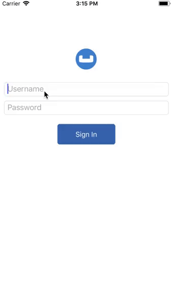
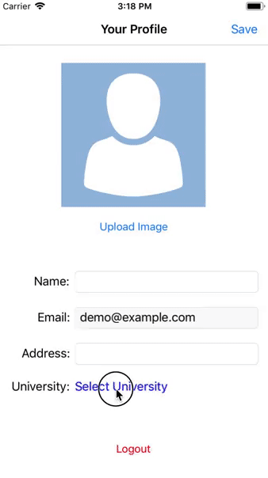
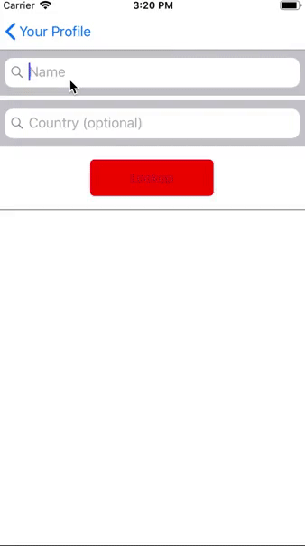
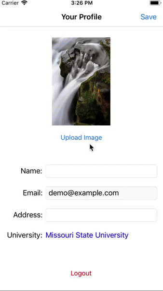

---
# frontmatter
path: "/tutorial-quickstart-xamarin-forms-query"
title: Quickstart in Couchbase Lite Query with C#, .NET, and Xamarin Forms
short_title: C# and Xamarin Query
description: 
  - Build an App in C# with Xamarin and Couchbase Lite using Query
  - Learn the basics of the QueryBuilder interface
  - See how you can bundle, load, and use a prebuilt instance of Couchbase Lite
content_type: quickstart
filter: mobile
technology: 
  - mobile
  - query
  - fts
landing_page: mobile
landing_order: 6
tags:
  - .NET
  - Xamarin
sdk_language:
  - csharp
length: 30 Mins
---

## Introduction

Couchbase Lite brings powerful querying and Full-Text-Search(FTS) capabilties to the edge. The new query interface is based on <a target="_blank" rel="noopener noreferrer" href="https://www.couchbase.com/products/n1ql">N1QL</a>, Couchbase’s declarative query language that extends <a target="_blank" rel="noopener noreferrer" href="https://www.sqlite.org/index.html">SQL</a> for JSON. If you are familiar with SQL, you will feel right at home with the semantics of the new API.  The query API is designed using the <a target="_blank" rel="noopener noreferrer" href="https://en.wikipedia.org/wiki/Fluent_interface">Fluent API Design Pattern</a>, and it uses method cascading to read to like a Domain Specific Language (DSL). This makes the interface very intuitive and easy to understand.


Couchbase Lite can be used as a standalone embedded database within your iOS, Android, and UWP mobile apps.

This tutorial will walk through a simple Xamarin app that will

* Demonstrate how you can bundle, load and use a  **_prebuilt_** instance of Couchbase Lite
* Introduce you to the basics of the `QueryBuilder` interface

You can learn more about Couchbase Mobile <a target="_blank" rel="noopener noreferrer" href="https://developer.couchbase.com/mobile">here</a>.

## Prerequisites

* This tutorial assumes familiarity with building apps with <a target="_blank" rel="noopener noreferrer" href="https://dotnet.microsoft.com/en-us/apps/xamarin">Xamarin</a>, more specifically <a target="_blank" rel="noopener noreferrer" href="https://dotnet.microsoft.com/en-us/apps/xamarin/xamarin-forms">Xamarin.Forms</a> using C# and <a target="_blank" rel="noopener noreferrer" href="https://docs.microsoft.com/en-us/visualstudio/xaml-tools/xaml-overview?view=vs-2022">XAML</a>.

* If you are unfamiliar with the basics of Couchbase Lite, it is recommended that you walk through the <a target="_blank" rel="noopener noreferrer" href="https://developer.couchbase.com/tutorial-quickstart-xamarin-forms-basic">Fundamentals Tutorial</a> on using Couchbase Lite as a standalone database.

* For iOS/Mac development, you will need a Mac running MacOS 11 or 12
* iOS/Mac (Xcode 12/13) - Download latest version from the <a target="_blank" rel="noopener noreferrer" href="https://itunes.apple.com/us/app/xcode/id497799835?mt=12">Mac App Store</a> or via <a target="_blank" rel="noopener noreferrer" href="https://github.com/RobotsAndPencils/XcodesApp">Xcodes</a>
> **Note**: If you are using an older version of Xcode, which you need to retain for other development needs, make a copy of your existing version of Xcode and install the latest Xcode version.  That way you can have multiple versions of Xcode on your Mac.  More information can be found in <a target="_blank" rel="noopener noreferrer" href="https://developer.apple.com/library/archive/technotes/tn2339/_index.html#//apple_ref/doc/uid/DTS40014588-CH1-I_HAVE_MULTIPLE_VERSIONS_OF_XCODE_INSTALLED_ON_MY_MACHINE__WHAT_VERSION_OF_XCODE_DO_THE_COMMAND_LINE_TOOLS_CURRENTLY_USE_">Apple's Developer Documentation</a>.  The open source <a target="_blank" rel="noopener noreferrer" href="https://github.com/RobotsAndPencils/XcodesApp">Xcodes</a> project simplifies this process.
* For Android development SDK version 22 or higher.  You can manage your Android SDK version in <a target="_blank" rel="noopener noreferrer" href="https://docs.microsoft.com/en-us/xamarin/android/get-started/installation/android-sdk?tabs=macos">Visual Studio</a>.
* For Universal Windows Platform (UWP) development, a Windows computer running Windows 10 1903 or higher.
> **Note**:  You can not edit or debug UWP projects with Visual Studio for Mac and you can't edit or debug Mac projects with Visual Studio for PC.
* Visual Studio for <a target="_blank" rel="noopener noreferrer" href="https://visualstudio.microsoft.com/vs/mac/">Mac</a> or <a target="_blank" rel="noopener noreferrer" href="https://visualstudio.microsoft.com/vs/">PC</a>.

## App Overview

We will be working with a very simple "User Profile" app. If you had walked through the <a target="_blank" rel="noopener noreferrer" href="https://developer.couchbase.com/tutorial-quickstart-xamarin-forms-basic">Fundamentals tutorial</a>, you would quickly realize that this version extends the functionality introduced in the version introduced in that tutorial.

This app does the following:

* Allows users to log in and create or update his/her user profile information. You could do that in the <a target="_blank" rel="noopener noreferrer" href="https://developer.couchbase.com/tutorial-quickstart-xamarin-forms-basic">Fundamentals tutorial</a>.

* As part of profile information, users have the ability to select a `University` from a list of possible options.

The list of matching univerisities is queried (using the new Query API) from a local _prebuilt_ "University" Couchbase Lite database that is bundled in the app. The user profile information is persisted as a `Document` in the local Couchbase Lite database. So subsquently, when the user logs out and logs back in again, the profile information is loaded from the `Database`.



## Installation

* To clone the project from GitHub, type the following command in your terminal

```bash
git clone https://github.com/couchbase-examples/dotnet-xamarin-cblite-userprofile-query
```

### Try it out

* Open the `UserProfileDemo.sln`. The project would be located at `/path/to/dotnet-xamarin-cblite-userprofile-query/src`.

```bash
open UserProfileDemo.sln
```

* Build the solution using your preferred IDE (e.g. Visual Studio for <a target="_blank" rel="noopener noreferrer" href="https://visualstudio.microsoft.com/vs/mac/">Mac</a> or <a target="_blank" rel="noopener noreferrer" href="https://visualstudio.microsoft.com/vs/">PC</a>).
* <a target="_blank" rel="noopener noreferrer" href="https://docs.microsoft.com/en-us/xamarin/get-started/first-app/index?pivots=windows">Run the app</a> on a device or simulator/emulator.
* Verify that you see the login screen.


## Solution Overview

The User Profile demo app is a Xamarin.Forms based solution that supports iOS and Android mobile platforms along with the UWP desktop platform.

The solution utilizes various design patterns and principles such as <a target="_blank" rel="noopener noreferrer" href="https://en.wikipedia.org/wiki/Model%E2%80%93view%E2%80%93viewmodel">MVVM</a>, <a target="_blank" rel="noopener noreferrer" href="https://en.wikipedia.org/wiki/Inversion_of_control">IoC</a>, and the Repository Pattern.

The solution consists of seven projects.

* **UserProfileDemo**: A .NET Standard project responsible for maintaining view-level functionality.
* **UserProfileDemo.Core**: A .NET Standard project responsible for maintaining viewmodel-level functionality.
* **UserProfileDemo.Models**: A .NET Standard project consisting of simple data models.
* **UserProfileDemo.Repositories**: A .NET Standard project consisting of repository classes responsible for Couchbase Lite database initilization, interaction, etc.
* **UserProfileDemo.iOS**: A Xamarin.iOS platform project responsible for building the `.ipa` file.
* **UserProfileDemo.Android**: A Xamarin.Android platform project responsible for building the `.apk` file.
* **UserProfileDemo.UWP**: A UWP platform project responsible for building the `.exe` file.

Now that you have an understanding of the solution architecture let's dive into the app!

## Couchbase Lite Nuget

Before diving into the code for the apps, it is important to point out the Couchbase Lite dependencies within the solution. The <a target="_blank" rel="noopener noreferrer" href="https://www.nuget.org/packages/Couchbase.Lite/">Couchbase.Lite Nuget package</a> is included as a reference within four projects of this solution:

1. UserProfileDemo.Repositories
2. UserProfileDemo.iOS
3. UserProfileDemo.Android
4. UserProfileDemo.UWP

The `Couchbase.Lite` Nuget package contains the core functionality for Couchbase Lite. In the following sections you will dive into the capabilities it the package provides.

## Data Model

Couchbase Lite is a JSON Document Store. A `Document` is a logical collection of named fields and values.The values are any valid JSON types. In addition to the standard JSON types, Couchbase Lite supports some special types like `Date` and `Blob`.  While it is not required or enforced, it is a recommended practice to include a **_"type"_** property that can serve as a namespace for related.

### The "User Profile" Document

The app deals with a single `Document` with a _"type"_ property of _"user"_.  The document ID is of the form *`"user::demo@example.com"`*.
An example of a document would be:

```json
{
    "type":"user",
    "name":"Jane Doe",
    "email":"jane.doe@earth.org",
    "address":"101 Main Street",
    "image":CBLBlob (image/jpg),
    "university":"Missouri State University"
}
```

### UserProfile

The **_"user"_** `Document` is encoded to a `class` named **_UserProfile_**.

```csharp
public class UserProfile
{
    public string type => "user";
    public string Id { get; set; }
    public string Name { get; set; }
    public string Email { get; set; }
    public string Address { get; set; }
    public byte[] ImageData { get; set; }
    public string Description { get; set; }
    public string University { get; set; }
}
```

## The "University" Document

The app comes bundled with a collection of documents of type _"university"_. Each `Document` represents a university.

```json
{
    "type":"university","web_pages": [
      "http://www.missouristate.edu/"
    ],
    "name": "Missouri State University",
    "alpha_two_code": "US",
    "state-province": MO,
    "domains": [
      "missouristate.edu"
    ],
    "country": "United States"
}
```

### University

The **_"university"_** `Document` is encoded to a `class` named **_University_**.

```csharp
public class University
{
    public string Name { get; set; }
    public string Country { get; set; }
}
```

## Using a Prebuilt Database
### Reasons
There are several reasons why you may want to bundle your app with a prebuilt database. This would be suited for data that does not change or change that often, so you can avoid the bandwidth and latency involved in fetching/syncing this data from a remote server. This also improves the overall user experience by reducing the start-up time.

In our app, the instance of Couchbase Lite that holds the pre-loaded **_"university"_** data is separate from the Couchbase Lite instance that holds **_"user"_** data hold the pre-loaded data.  

A separate Couchbase Lite instance is not required. However, in our case, since there can be many users potentially using the app on a given device,  it makes more sense to keep it separate. This is to avoid duplication of pre-loaded data for every user.

### Location 

The pre-built database will be in the form of a `cblite` file. It should be be in your app project bundle:

#### iOS

* In the `UserProfileDemo.iOS` project, locate the `universities.cblite2` folder at the root.


#### Android

* In the `UserProfileDemo.Android` cfrtg project, locate the `universities.zip` file within the `Assets` folder. Note that the cblite folder will be extracted from the zip file.


#### UWP

* In the `UserProfileDemo.UWP` project, locate the `universities.cblite2` folder at the root.


### Loading

* Open the <a target="_blank" rel="noopener noreferrer" href="https://github.com/couchbase-examples/dotnet-xamarin-cblite-userprofile-query/blob/main/src/UserProfileDemo.Repositories/DatabaseManager.cs">DatabaseManager.cs</a> file and locate the `GetDatabaseAsync` method. The prebuilt database is common to all users of the app (on the device). So it will be loaded once and shared by all users on the device.

```csharp
public async Task<Database> GetDatabaseAsync()
```

* First, we create an instance of `DatabaseConfiguration` object and specify the path where the database would be located

```csharp
var options = new DatabaseConfiguration();
var defaultDirectory = Service
    .GetInstance<IDefaultDirectoryResolver>()
    .DefaultDirectory();
options.Directory = defaultDirectory;
```

* Then we determine if the "universities" database already exists at the specified location. It would not be present if this is the first time we are using the app, in which case, we locate the _"universities.cblite"_ resource within the platform project and we copy it over to the database folder.

```csharp
// The path to copy the prebuilt database to
var databaseSeedService = ServiceContainer.GetInstance<IDatabaseSeedService>();

if (databaseSeedService != null)
{
    await databaseSeedService.CopyDatabaseAsync(defaultDirectory);
    _database = new Database(_databaseName, options);
    CreateUniversitiesDatabaseIndexes();
} 
```

If the database is already present at the specified Database location, we simply open the database.

```csharp
_database = new Database(_databaseName, options);
```

### Indexing 

* Creating indexes for non-FTS based queries is optional. However, in order to speed up queries, you can create indexes on the properties that you would query against. Indexing is handled eagerly.

* In the <a target="_blank" rel="noopener noreferrer" href="https://github.com/couchbase-examples/dotnet-xamarin-cblite-userprofile-query/blob/main/src/UserProfileDemo.Repositories/DatabaseManager.cs">DatabaseManager.cs</a> file, locate the `CreateUniversitiesDatabaseIndexes` method. We create an index on the `name` and `location` properties of the documents in the _university_ database.

```csharp
void CreateUniversitiesDatabaseIndexes()
{
    _database.CreateIndex("NameLocationIndex",
        IndexBuilder.ValueIndex(ValueIndexItem.Expression(Expression.Property("name")),
            ValueIndexItem.Expression(Expression.Property("location"))));
}
```

### Closing the Database

When a user logs out, we close the pre-built database along with other user-specific databases

* In the <a target="_blank" rel="noopener noreferrer" href="https://github.com/couchbase-examples/dotnet-xamarin-cblite-userprofile-query/blob/main/src/UserProfileDemo.Repositories/BaseRepository.cs">*BaseRepository.cs*</a> file, locate the `Dispose` function.

```csharp
public virtual void Dispose()
```

* Closing the database is pretty straightforward

```csharp
_database.Close();
```

### Try It Out

* The app should be running in the simulator (iOS) or emulator (Android).
* Log into the app with any email Id and password. Let's use the values **_"demo@example.com"_** and **_"password"_** for user Id and password fields respectively. If this is the first time that _any_ user is signing in to the app, the pre-built database will be loaded from the App Bundle. In addition, new user-specific Database will be created / opened.

#### Confirmation of Results (iOS)

* Confirm that the console log output has a message similar to the one below. In my example, I am logging in with a user email Id of **_"demo@example.com"_**.

```bash
Will open Prebuilt DB  at path /Users/[user_id]/Library/Developer/CoreSimulator/Devices/[unique_device_id]/data/Containers/Data/Application/[unique_app_id]/Library/Application Support

2018-05-04 17:04:16.319360-0400 UserProfileDemo[54115:13479070] CouchbaseLite/2.0.0 (Swift; iOS 11.3; iPhone) Build/806 Commit/2f2a2097+CHANGES LiteCore/2.0.0 (806)

2018-05-04 17:04:16.319721-0400 UserProfileDemo[54115:13479070] CouchbaseLite minimum log level is Verbose
Will open/create DB  at path /Users/[user_name]/Library/Developer/CoreSimulator/Devices/[unique_device_id]/data/Containers/Data/Application/[unique_app_id]/Library/Application Support/demo@example.com
```

* The above log message indicate the location of the Prebuilt database as well as the Database for the user. This would be within the _Application Support_ folder.
* Open the folder in your Finder app and verify that a Database with name **_"univerities"_** exists along with a user specific Database with name **_"userprofile"_**


## Exploring the Query API

The Query API in Couchbase Lite is extensive. In our app, we will be using the `QueryBuilder` API to make a simple _pattern matching_ query using the `like` operator.

### Fetching University Document

From the "Your Profile" screen, when the user taps on the "University" cell, a search screen is displayed where the user can enter the search criteria (name and optionally, the location) for the university. When the search criteria is entered, the local _"universities"_ database is queried for [The "University" Document](#the-university-document) documents that match the specified search criteria.

* Open the <a target="_blank" rel="noopener noreferrer" href="https://github.com/couchbase-examples/dotnet-xamarin-cblite-userprofile-query/blob/main/src/UserProfileDemo.Repositories/UniversityRepository.cs">UniversityRepository.cs</a> file and locate the `SearchByName` method.

```csharp
public async Task<List<University>> SearchByName(string name, string country = null)
```

* We build the Query using the `QueryBuilder` API that will look for Documents that match the specified criteria.

```csharp
var whereQueryExpression = Function
                            .Lower(Expression.Property("name"))
                            .Like(Expression.String($"%{name.ToLower()}%")); // <1>

if (!string.IsNullOrEmpty(country))
{
  var countryQueryExpression = Function.Lower(Expression.Property("country")).Like(Expression.String($"%{country.ToLower()}%")); // <2>

  whereQueryExpression = whereQueryExpression.And(countryQueryExpression); // <3>
}

var query = QueryBuilder.Select(SelectResult.All()) // <4>
                .From(DataSource.Database(database)) // <5>
                .Where(whereQueryExpression); // <6>

```

**<1>** Build a `QueryExpression` that uses the `like` operator to look for the specified **_"name"_** string in the **_"name"_** property. Notice couple of things here: 
- The use of **wildcard "%" operator** to denote that we are looking for the presence of the string anywhere in the **_"name"_** property and 
- The use of `Function.Lower()` to convert the search string into lowercase equivalent. Since `like` operator does **_case-senstive matching_**, we convert the search string and the property value to lowercase equivalents and compare the two.

**<2>** If the location criteria was specified in the search, then Build a `QueryExpression` that uses the `Like` operator to look for the specified **_"location"_** string in the **_"location"_** property.
**<3>** The `SelectResult.All()` specifiees that we are interested in all properties in Documents that match the specified criteria
**<4>** The `DataSource.Database(database)` specified the Data Source
**<5>** We include the `Where` clause that is the logical ANDing of the QueryExpression in **<1>** and **<2>**  
  
* We run the Query by calling the `Execute()` method on the Query that was constructed in the previous step

```csharp
var results = query.Execute().AllResults();

if (results?.Count > 0)
{
    universities = new List<University>(); // <1>

    foreach (var result in results)
    {
        var dictionary = result.GetDictionary("universities");

        if (dictionary != null)
        {
            var university = new University
            {
                Name = dictionary.GetString("name"), // <2>
                Country = dictionary.GetString("country") // <2>
            };

            universities.Add(university);
        }
    }
}
```

**<1>** Create an instance of [University](#university) type
**<2>** Use specific type getters to fetch property values. The [University](#university) instance is populated with these property values.

### Try It Out

1. You should have followed the steps discussed in the "Try It Out" section under [Loading the Prebuilt Database](#loading-the-prebuilt-database)
2. Tap on the "Select University" button
3. You should see a screen show that allows you enter the search criteria for the university
4. Enter "Missouri" for name . You can optionally enter "United States" for location
5. Confirm that you see a list of universities that match the criteria



6. Select a university
7. Press "Done" button
8. Confirm that the university you selected shows up as the selected university



9. You can optionally fill in other entries in the User Profile screen
10. Tap "Done" button
11. Confirm that you see an alert message "Succesfully Updated Profile". The Document will be updated this time.
12. Tap "Logout" and log out of the app
13. Log back into the app with the same user email Id and password that you used earlier. In my example, I used **_"demo@example.com"_** and **_"password"_**. So I will log in with those credentials again.
14. Confirm that you see the profile screen  with the _university_ value that you set earlier.



## Learn More

Congratulations on completing this tutorial!

This tutorial walked you through an example of how to use a pre-built Couchbase Lite database. We looked at a simple Query example. Check out the following links for further details on the Query API.

### Further Reading

* <a target="_blank" rel="noopener noreferrer" href="https://blog.couchbase.com/sql-for-json-query-interface-couchbase-mobile/">Fundamentals of the Couchbase Lite Query API</a>
* <a target="_blank" rel="noopener noreferrer" href="https://blog.couchbase.com/querying-array-collections-couchbase-mobile/">Handling Arrays in Queries</a>
* <a target="_blank" rel="noopener noreferrer" href="https://blog.couchbase.com/full-text-search-couchbase-mobile-2-0/">Couchbase Lite Full Text Search API</a>
* <a target="_blank" rel="noopener noreferrer" href="https://blog.couchbase.com/join-queries-couchbase-mobile/">Couchbase Lite JOIN Query</a>
