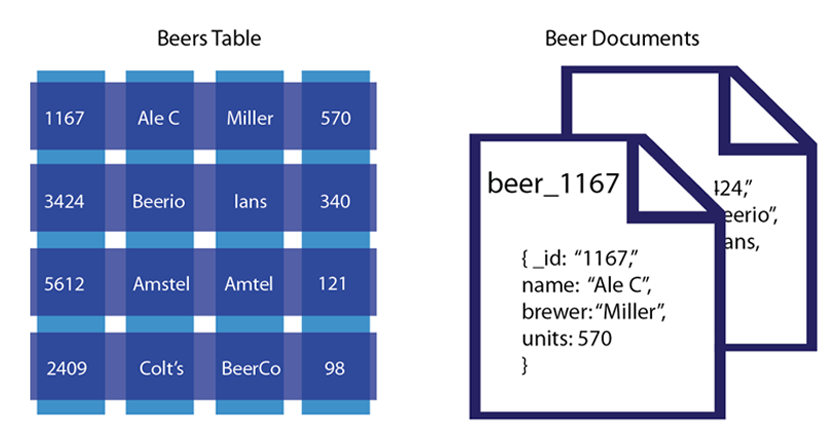
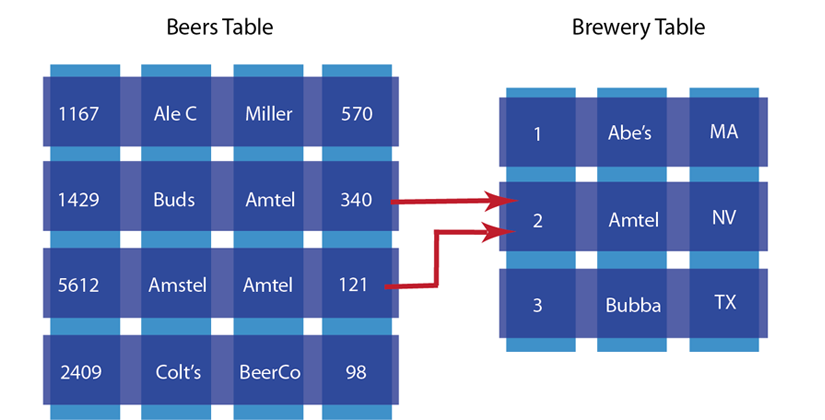
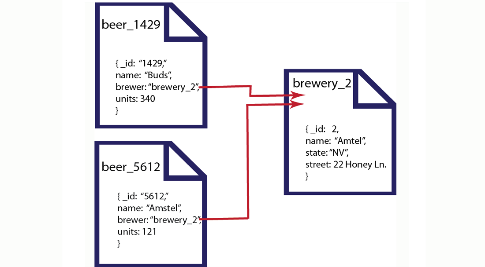

---
# frontmatter
path: "/tutorial-comparing-document-oriented-relational-data"
title: Comparing Document-Oriented and Relational Data
short_title: Document vs Relational
description: 
  - In this tutorial we compare document-oriented data models to relational ones
  - Learn the different characteristics of each and explore the flexibility of Couchbase
  - See an example dataset get mapped from relational to document-based
content_type: tutorial
filter: n1ql
technology:
  - kv
  - capella
  - server
tags:
  - Data Modeling
sdk_language:
  - any
length: 10 Mins
---

In a relational database system you must define a _schema_ before adding records to a database. The schema is the structure described in a formal language supported by the database and provides a blueprint for the tables in a database and the relationships between tables of data. Within a table, you need to define constraints in terms of rows and named columns as well as the type of data that can be stored in each column.

In contrast, a document-oriented database contains _documents_, which are records that describe the data in the document, as well as the actual data. Documents can be as complex as you choose; you can use nested data to provide additional sub-categories of information about your object. You can also use one or more document to represent a real-world object. The following compares a conventional table with document-based objects:

In this example we have a table that represents beers and their respective attributes: id, beer name, brewer, bottles available and so forth. As we see in this illustration, the relational model conforms to a schema with a specified number of fields which represent a specific purpose and data type. The equivalent document-based model has an individual document per beer; each document contains the same types of information for a specific beer.

In a document-oriented model, data objects are stored as documents; each document stores your data and enables you to update the data or delete it. Instead of columns with names and data types, we describe the data in the document, and provide the value for that description. If we wanted to add attributes to a beer in a relational model, we would need to modify the database schema to include the additional columns and their data types. In the case of document-based data, we would add additional key-value pairs into our documents to represent the new fields.

The other characteristic of relational database is _data normalization_; this means you decompose data into smaller, related tables. The figure below illustrates this:

In the relational model, data is shared across multiple tables. The advantage to this model is that there is less duplicated data in the database. If we did not separate beers and breweries into different tables and had one beer table instead, we would have repeated information about breweries for each beer produced by that brewer.

The problem with this approach is that when you change information across tables, you need to lock those tables simultaneously to ensure information changes across the table consistently. Because you also spread information across a rigid structure, it makes it more difficult to change the structure during production, and it is also difficult to distribute the data across multiple servers.

In the document-oriented database, we could choose to have two different document structures: one for beers, and one for breweries. Instead of splitting your application objects into tables and rows, you would turn them into documents. By providing a reference in the beer document to a brewery document, you create a relationship between the two entities:

In this example we have two different beers from the Amstel brewery. We represent each beer as a separate document and reference the brewery in the brewer field. The document-oriented approach provides several upsides compared to the traditional RDBMS model. First, because information is stored in documents, updating a schema is a matter of updating the documents for that type of object. This can be done with no system downtime. Secondly, we can distribute the information across multiple servers with greater ease. Since records are contained within entire documents, it makes it easier to move, or replicate an entire object to another server.
