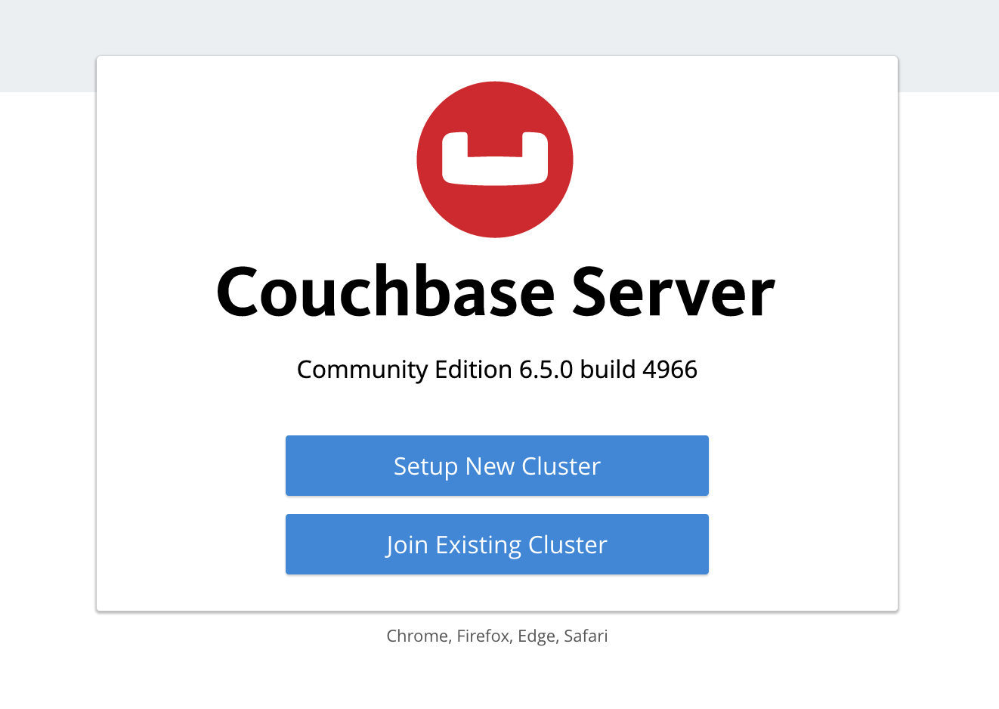
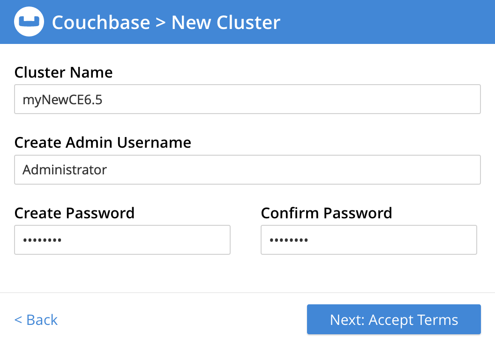
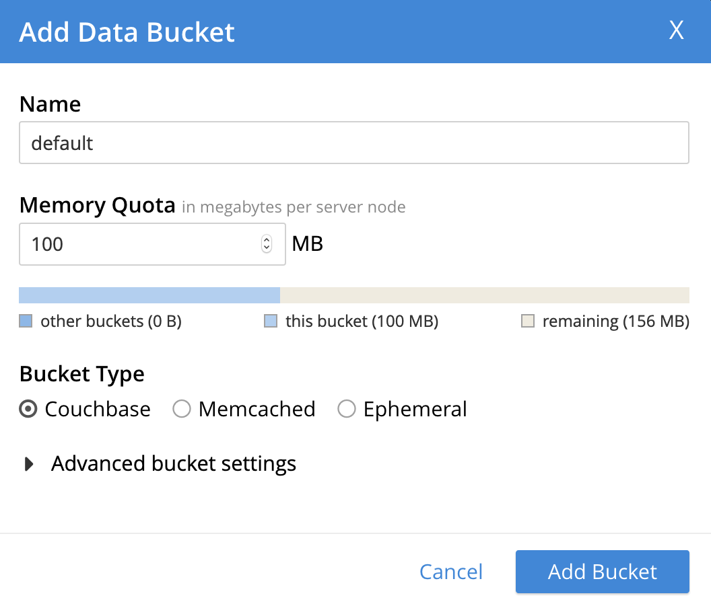
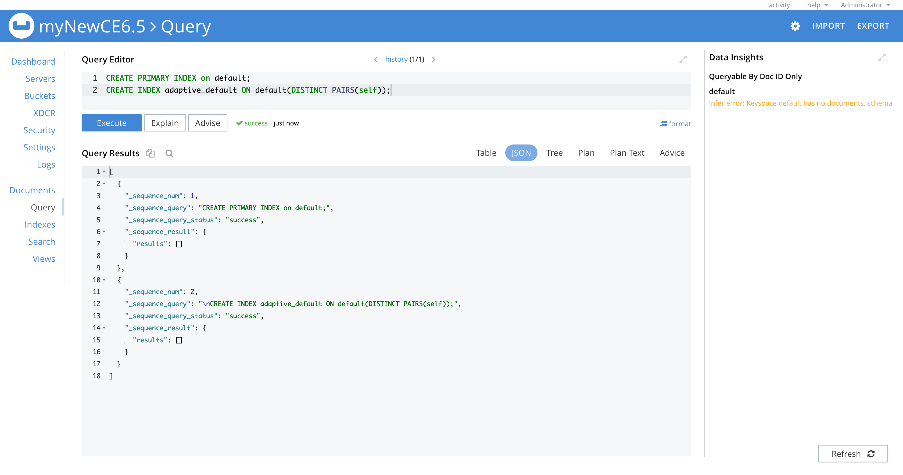

---
# frontmatter
path: "/tutorial-docker-image-manual-cb65"
title: Couchbase Server CE - Manual Docker Configuration
short_title: Couchbase CE and Docker
description: 
  - Get started with Couchbase Server Community Edition (CE) on docker
  - Learn how to manually configure CE to run in a containerized environment
  - See how you can configure Couchbase programmatically with our REST API
content_type: tutorial
filter: other
technology:
  - server
tags:
  - Docker
  - Configuration
  - Community Edition
sdk_language: 
  - any
length: 5 Mins
---

For the QuickStart exercises, a Couchbase CE 6.5 docker container can be configured with minimal system footprint using the following steps.

## Prerequisite: Download and Install Docker

If Docker is not already running, go to the <a href="https://www.docker.com/get-docker" target="_blank">Docker installation page</a> and follow the instructions.

## Step 1: Run the Couchbase Server CE container image, and load the WebUI

Open a console window on your computer and enter the following command.  Docker will pull the image from Docker Hub and run it:

```bash
docker run -d --name ce-6.5 -p 8091-8096:8091-8096 -p 11210-11211:11210-11211 couchbase:community-6.5.0
```

Sample terminal output:

```bash
$ docker run -d --name ce-6.5 -p 8091-8096:8091-8096 -p 11210-11211:11210-11211 couchbase:community-6.5.0
Unable to find image 'couchbase:community-6.5.0' locally
community-6.5.0: Pulling from library/couchbase
fe703b657a32: Already exists 
f9df1fafd224: Already exists 
a645a4b887f9: Already exists 
57db7fe0b522: Already exists 
37acf92bdab2: Already exists 
987c67d0449f: Pull complete 
d1e7b7590466: Pull complete 
5d6276be31bb: Pull complete 
cdbfb2490731: Pull complete 
f48150deedae: Pull complete 
fe4e6a8d4c85: Pull complete 
9936f46b618f: Pull complete 
b3a0ca456492: Pull complete 
Digest: sha256:9a051d3bd5e34d4ae357d009f1c1640ed58bd6db2c7fc9e87fd382ccf9de52c2
Status: Downloaded newer image for couchbase:community-6.5.0
d1cd955621a98fd8193652e36197def479396af6cb77b861cf86254dd511fbaa
```

Open the Couchbase WebUI by navigating your web browser to this address: `localhost:8091`



NOTE: The remaining manual steps can be more quickly accomplished via the Couchbase REST API.  If you would prefer to use the REST API, skip to the [Configuration Using Couchbase REST API](#configuration-using-couchbase-rest-api) section at the bottom of this page.

## Step 2: Configure Couchbase as a minimal single node cluster

Click the "Setup New Cluster" button on the welcome screen.

Enter any cluster name and password.  



Click "Next.."

In the next screen, check the "I accept..." box to indicate your acceptance of the terms and conditions.  


Click the "Configure Disk, Memory, Services" button. Set all the memory quotas to the 256MB minimum:


Click "Save and Finish". You will be presented with a blank Dashboard screen.


NOTE: The memory quotas can be further adjusted.  Click "Settings" in the left-hand navigation bar. Under "Memory Quotas" make your changes.  Click "Save", and then "Confirm".

## Step 3: Create a new data bucket

Click "Buckets" in the left-hand navigation bar, then click the "ADD BUCKET" link in the upper right corner. Enter "default" for the Name, and 100 MB for the Memory Quota.



Click the "Add Bucket" button at the bottom.


NOTE: You can ignore the "At least two servers..." warning in the lower left.

## Step 4: Create secondary indexes

The CREATE INDEX statement is used for creating secondary indexes.  We will use the query workbench to create 2 indexes to facilitate our exercises:

* one "primary index" to make initial queries easy to execute
* one "adaptive index" to support faster filtered queries

Click "Query" in the left-hand navigation bar.

NOTE: If you receive the "Received error 404 ... " message then just refresh your browser.

Paste both following statements into the Query Editor and click "Execute":

```sql
CREATE PRIMARY INDEX ON default;
CREATE INDEX adaptive_default ON default(DISTINCT PAIRS(self));
```



Click "Indexes" in the left-hand navigation bar to see the indexes.


## Configuration Using Couchbase REST API

If you have `curl` utility available, you can perform the node configuration via the command line:

```bash
# Set minimal memory quotas
curl -v http://127.0.0.1:8091/pools/default \
-d memoryQuota=256 -d indexMemoryQuota=256

# Configure data, query, and index services to run
curl -v http://127.0.0.1:8091/node/controller/setupServices \ 
-d services=kv%2Cn1ql%2Cindex

# Set Admin credentials
curl -v http://127.0.0.1:8091/settings/web -d port=8091 \ 
-d username=Administrator -d password=password

# Set index storage mode to on-disk
curl -v -u Administrator:password \ 
-X POST http://127.0.0.1:8091/settings/indexes \ 
-d 'storageMode=forestdb'

# Create a 'default' data bucket 
curl -v -u Administrator:password \ 
-X POST http://127.0.0.1:8091/pools/default/buckets \ 
-d name=default -d bucketType=couchbase -d ramQuotaMB=128

sleep 10

# Create primary index on 'default' bucket
curl -v -u Administrator:password \ 
http://127.0.0.1:8093/query/service  \ 
-d 'statement=CREATE PRIMARY INDEX ON `default`'

# Create adaptive index on 'default' bucket
curl -v -u Administrator:password \ 
http://127.0.0.1:8093/query/service  \ 
-d 'statement=CREATE INDEX `ai_self`ON `default`(DISTINCT PAIRS(self))' 

```

## Done!

You can continue with your quickstart exercises.  
