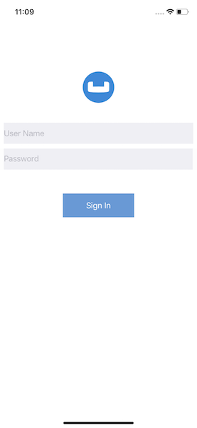
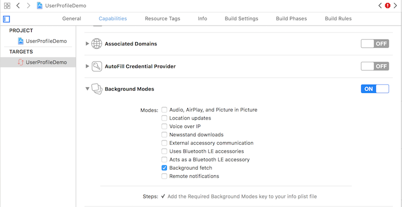
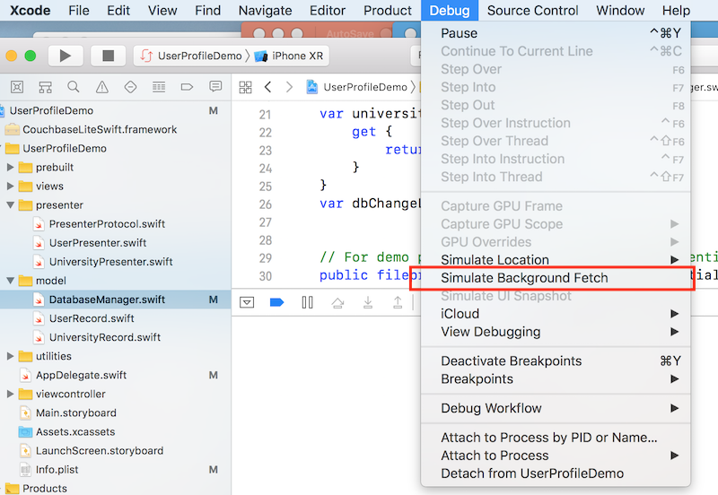
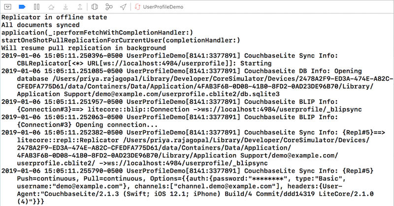
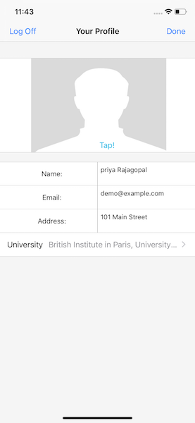

---
# frontmatter
path: "/tutorial-background-refresh-ios-uikit"
title: Tutorial Background App Refresh in iOS with UIKit and Swift
short_title: Background App Refresh
description: 
  - Build an iOS App in Swift with UIKit that uses Background App Refresh
  - Learn how to do a one-shot sync with Couchbase Sync Gateway in the background
  - Learn how to configure your iOS app to support Background App Refresh
content_type: tutorial
filter: mobile
technology: 
  - mobile
  - sync gateway
landing_page: none 
landing_order: 13 
tags:
  - iOS
  - UIKit
sdk_language:
  - swift
length: 30 Mins
---

## Introduction

The ability for a mobile app to run in the background is an important element of the life cycle of a mobile application. The ability to sync data while in the background would be useful in several scenarios. Background support is platform specific and is hence not built into Couchbase Lite. However, one can easily leverage the various platform specific backgrounding capabilities to perform data sync over Couchbase Mobile.

This tutorial will demonstrate how to:

* Configure your iOS app for Background Fetch support
* Setup your app to do a one-shot sync with Couchbase Sync Gateway while in the background

We will be using a Swift App as an example of a Couchbase Lite enabled client.

More information on [Sync Gateway](https://developer.couchbase.com/documentation/mobile/2.0/guides/sync-gateway/index.html) can be found in our documentation site.

## Prerequisites

This tutorial assumes familiarity with building swift apps with Xcode and with Couchbase Lite.

* You must have completed the "user profile" tutorial on **sync**. If you haven't already done so, please complete the following tutorial first
  * [Fundamentals of Sync](https://docs.couchbase.com/tutorials/userprofile-couchbase-mobile/sync/userprofile/userprofile_sync.html) using Couchbase Lite and Sync Gateway

* iOS (Xcode 11+)
  * Download latest version from the [Mac App Store](https://itunes.apple.com/us/app/xcode/id497799835?mt=12)
  * NOTE: If you are on an older version of Xcode that you must retain for your other development needs, you can make a copy of your existing version of Xcode and install Xcode 10. So you can have multiple versions of Xcode on your Mac.

* git (Optional) This is required if you would prefer to pull the source code from GitHub repo.
  * Create a [free github account](https://github.com) if you don't already have one
  * git can be downloaded from [git-scm.org](https://git-scm.com/book/en/v2/Getting-Started-Installing-Git)

* curl HTTP client
  * You could use any HTTP client of your choice. But we will use *curl* in our tutorial. Download latest version from [curl website](https://curl.haxx.se/download.html)

## System Overview

We will be working with a simple "User Profile" app which we introduced in the [Fundamentals Tutorial](https://developer.couchbase.com/documentation/mobile/2.0/userprofile_basic.html) and extended to support data sync capabilities in the [Sync Tutorial](https://docs.couchbase.com/tutorials/userprofile-couchbase-mobile/sync/userprofile/userprofile_sync.html).

In this tutorial, we will be extending that app to support data sync when in the background.

The app does the following

* Allows users to log in and create or update his/her user profile information. The user profile view is automatically updated everytime the profile information changes in the underlying database
* The user profile information is synced with a remote Sync Gateway which then syncs it to other devices (subject to access control and routing configurations specified in the `sync function`)
* When the app is woken up in the _background_, it does a one-shot replication with the remote Sync Gateway

## App Installation

### Fetching App Source Code

You have two options

#### Option 1 : Git Clone

* Clone the _backgroundfetch_ branch of the `User Profile Demo` project from GitHub. Type the following command in your terminal

```shell
  git clone -b backgroundfetch https://github.com/couchbaselabs/userprofile-couchbase-mobile.git
```

#### Option 2 : Download .zip

* A download for the [User Profile Demo project](https://github.com/couchbaselabs/userprofile-couchbase-mobile/archive/backgroundfetch.zip) can be found in our documentation site.

## Installing Couchbase Lite Framework

* Next, we will download the latest version of Couchbase Lite 2.x framework. The Couchbase Lite iOS framework is [distributed](https://developer.couchbase.com/documentation/mobile/current/couchbase-lite/swift.html)via Cocoapods, Carthage or you can download the pre-built framework. In our example, we will be downloading the pre-built version of the framework. For this, type the following in the command terminal

```shell
  cd /path/to/UserProfileDemo/content/modules/userprofile/examples

  sh install_11.sh
```

let's verify the installation

### Try it Out by Building and Running

* Open the `UserProfileDemo.xcodeproj`. The project would be located at `/path/to/UserProfileDemo/content/modules/userprofile/examples`

```shell
open UserProfileDemo.xcodeproj
```

* Build and run the project in the simulator using Xcode
* Verify that you see the login screen




## Sync Gateway 2.x Installation

Follow the steps outlined in the [Sync Tutorial](https://docs.couchbase.com/tutorials/userprofile-couchbase-mobile/sync/userprofile/userprofile_sync.html#sync-gateway-2-0-installationto) install the Sync Gateway on localhost running in walrus mode.

Note that the walrus must is a development-only mode used for testing/demonstration purposes. It must be **never** used in production.

Now, let's verify the installation

### Try it Out in the Browser

* Open a browser and enter `http://localhost:4984` in the address bar
* You should see a message similar one below

```shell
{"couchdb":"Welcome","vendor":{"name":"Couchbase Sync Gateway","version":"2.0"},"version":"Couchbase Sync Gateway/2.0.0(832;2d8a6c0)"}
```

## Data Model

There are two documents - the "user profile" type document and "university" type document. We will use the same data model as discussed in [data model section](https://docs.couchbase.com/tutorials/userprofile-couchbase-mobile/sync/userprofile/userprofile_sync.html#data-model) of the Sync tutorial.

## Configuring App for Background App Refresh

iOS supports several backgrounding models. One such option is Background App Refresh. According to [Apple docs](https://developer.apple.com/documentation/uikit/core_app/managing_your_app_s_life_cycle/preparing_your_app_to_run_in_the_background/updating_your_app_with_background_app_refresh), _Background App Refresh_ lets your app run periodically in the background so that it can update its content. The iOS system uses its discretion to determine when to wake up and run your app, typically by learning your app usage over time. In other words, there is no guarantee that your app will have an opportunity to run in the background. Even when provided with the opportunity, the app gets a finite amount of time to run.

* Open the "capabilities" tab in the **UserProfileDemo.xcodeproj** file. Note that "Background Fetch" is enabled under the "Background models" tab


* Open the **AppDelegate.swift** file and locate the `application:didFinishLaunchingWithOptions()` function.

```swift
func application(_ application: UIApplication, didFinishLaunchingWithOptions launchOptions: [UIApplicationLaunchOptionsKey: Any]?) -> Bool {
    // Override point for customization after application launch.
    self.loadLoginViewController()
    UIApplication.shared.setMinimumBackgroundFetchInterval(UIApplicationBackgroundFetchIntervalMinimum)
    return true
```

* Here we specify the periodicity at which the app should be woken up. We use a value of _UIApplicationBackgroundFetchIntervalMinimum_ which is the smallest fetch interval supported by the system  

## Implementing the Background Fetch callback

* Open the **AppDelegate.swift** file and locate the `application:performFetchWithCompletionHandler()` function. This callback function is invoked by the system everything the app is launched in the background.

```swift
// Support for background fetch
func application( _ application: UIApplication,
                    performFetchWithCompletionHandler
    completionHandler: @escaping (UIBackgroundFetchResult) -> Void) {
    print(#function)
    
    // Do a one shot replication
    self.cbMgr.startOneShotPullReplicationForCurrentUser { (status) in
        completionHandler(.newData) // <1>
    }
}
```

<1> Invoke function on to do a one-shot replication with the Sync Gateway. Everytime the app is launched, all pending changes with the remote Sync Gateway will be synched up

## Implementing the One-shot replication

Setting up the app for one-shot replication is very similar to continuous replication that was discussed in the [Sync tutorial](https://docs.couchbase.com/tutorials/userprofile-couchbase-mobile/sync/userprofile/userprofile_sync.html#starting-replication).

* Open the **DatabaseManager.swift** file and locate the `startOneShotPullReplicationForCurrentUser()` function.

```swift
func startOneShotPullReplicationForCurrentUser(completionHandler:@escaping(_ doneStatus:Bool)->Void) {
```

* Let's examine the replicator configuration

```swift
let dbUrl = remoteUrl.appendingPathComponent(kDBName)
let config = ReplicatorConfiguration.init(database: db, target: URLEndpoint.init(url:dbUrl))
config.continuous =  false // <1>
config.replicatorType = .pull // <2>
config.authenticator =  BasicAuthenticator(username: user, password: password)
```

<1> The"continuous" mode is set to "false" in the Replicator configuration indicating that this is a one-shot replication. In one-shot mode, the replicator goes into idle state once all pending changes are synced
<2> The "replicationType" is set to pull-only in the Replicator configuration indicating that the app will only pull changes from remote client when in the background.

The rest of the configuration is as in the continuous replication case.

## Exercises

Before proceeding with the exercises in this section, complete the exercises in the [Sync tutorial](https://docs.couchbase.com/tutorials/userprofile-couchbase-mobile/sync/userprofile/userprofile_sync.html#exercises) to verify that you can sync changes between the app and Sync Gateway with the app in the foreground.

In the following exercise, we will observe how changes made on Sync Gateway are fetched by the iOS app in the background

* The app must be running in the simulator with the _xcode debugger attached_. This is important as we will use the xcode debugger for simulating background fetches.
* Push the app in the simulator to the background. Typically you can do it with the Shift-Cmd-H key combination
* Clear the debug console logs in xcode. This will make it easier to identify what goes on when the app is launched in the background
* Open the command terminal and issue the following `curl` command to get the user profile document on the Sync Gateway via GET Document REST API

```swift
curl -X GET \
  http://localhost:4985/userprofile/user::demo@example.com \
  -H 'Accept: application/json' \
  -H 'Cache-Control: no-cache' \
  -H 'Content-Type: application/json'
```

* Your response should look something like the response below. The exact contents depends on the user profile that you provided via your mobile app.

```swift
{
  "_attachments": {
    "blob_/image": {
      "content_type": "image/jpeg",
      "digest": "sha1-9OHO0QIk+kREiOaoMlrEg/jU4zU=",
      "length": 15110,
      "revpos": 1,
      "stub": true
    }
  },
  "_id": "user::demo@example.com",
  "_rev": "1-0b9e3efa5ec1b1596564c4db34ba28d4e618f9c5",
  "address": "",
  "email": "demo@example.com",
  "image": {
    "@type": "blob",
    "content_type": "image/jpeg",
    "digest": "sha1-9OHO0QIk+kREiOaoMlrEg/jU4zU=",
    "length": 15110
  },
  "name": "",
  "type": "user"
}
```

* In the command terminal, issue the following command to update the user profile document on the Sync Gateway

```swift
curl -X PUT \
  'http://localhost:4985/userprofile/user::demo@example.com?rev=1-0b9e3efa5ec1b1596564c4db34ba28d4e618f9c5' \
  -H 'Accept: application/json' \
  -H 'Cache-Control: no-cache' \
  -H 'Content-Type: application/json' \
  -d '{
  "address": "101 Main Street",
  "email": "demo@example.com",
  "image": {
    "@type": "blob",
    "content_type": "image/jpeg",
    "digest": "sha1-S8asPSgzA+F+fp8/2DdIy4K+0U8=",
    "length": 14989
  },
  "name": "priya Rajagopal",
  "type": "user",
  "university": "British Institute in Paris, University of London"
}'
```

* Launch the iOS app in the background. You will simulate this through the Xcode Debug menu to "Simulate Background Fetch"



* Observe the console logs. You would see a set of messages indicating that the app has pulled the latest changes from the Sync Gateway



* Stop the Sync Gateway

* Launch the app in the foreground. The user profile doc that was synced in the background will be displayed.



## Learn More

Congratulations on completing this tutorial!

This tutorial walked you through an example of how to synchronize data between Sync Gateway and Couchbase Lite enabled mobile app running in the background.

Check out the following links for further details

### Further Reading

* [Apple Backgrounding Support](https://developer.apple.com/library/archive/documentation/iPhone/Conceptual/iPhoneOSProgrammingGuide/BackgroundExecution/BackgroundExecution.html)
* [Overview of Replication Protocol 2.0](https://blog.couchbase.com/data-replication-couchbase-mobile/)
