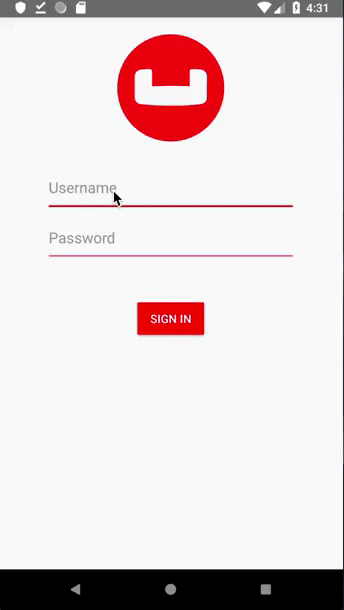
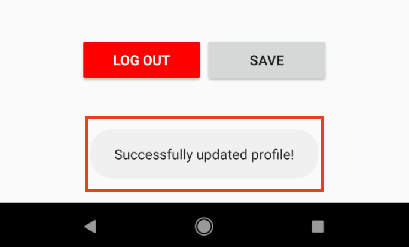
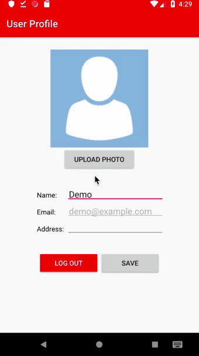
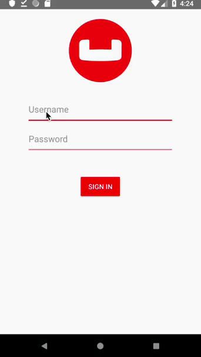

---
# frontmatter
path: "/tutorial-quickstart-android-java-basic"
title: Quickstart in Couchbase Lite with Android and Java
short_title: Couchbase Lite Fundamentals
description: 
  - Learn how to install Couchbase Lite
  - Build an Android App in Java with Couchbase Lite
  - Learn how to Create, Read, Update, and Delete documents
content_type: quickstart
filter: mobile
technology: 
  - mobile
  - kv
  - query
landing_page: mobile
landing_order: 2
tags:
  - Android
sdk_language:
  - android-java
length: 30 Mins
---

## Introduction

Couchbase Mobile brings the power of NoSQL to the edge. It is comprised of three components:

* **Couchbase Lite**, an embedded, NoSQL JSON Document Style database for your mobile apps.
* **Sync Gateway**, an internet-facing synchronization mechanism that securely syncs data between mobile clients and server.
* **Couchbase Server**, a highly scalable, distributed NoSQL database platform.

Couchbase Mobile supports flexible deployment models. You can deploy

* Couchbase Lite as a standalone embedded database within your mobile apps or,
* Couchbase Lite enabled mobile clients with a Sync Gateway to synchronize data between your mobile clients or,
* Couchbase Lite enabled clients with a Sync Gateway to sync data between mobile clients and the Couchbase Server, which can persist data in the cloud (public or private)

This tutorial will walk you through a very basic example of how you can use *Couchbase Lite 3.0 in standalone mode* within your **<a target="_blank" rel="noopener noreferrer" href="https://developer.android.com/">Android</a>** app.

You will learn the fundamentals of

* Database Operations
* Document CRUD Operations via Key/Value Pair

## Prerequisites

This tutorial assumes familiarity with building Android apps using <a target="_blank" rel="noopener noreferrer" href="https://adoptopenjdk.net/">Java</a> and a computer with the following installed and setup:

* <a target="_blank" rel="noopener noreferrer" href="https://developer.android.com/studio">Android Studio Artic Fox (2020.3.1) or above</a>
* Android SDK installed and setup (v.31)
* Android Build Tools (> v.31)
* Android device or emulator running API level 22 or above
* JDK 8 (now embedded into Android Studio Artic Fox)

## App Overview

In this tutorial, you will be working with an app that allows users to log in and make changes to their user profile information.

User profile information is persisted as a `Document` in the local Couchbase Lite `Database`. When the user logs out and logs back in again, the profile information is loaded from the `Database`.



## Installation

### Fetching App Source Code

#### Clone Source Code

* Clone the `User Profile Standalone Demo` repository from GitHub.

```bash
git clone https://github.com/couchbase-examples/android-java-cblite-userprofile-standalone.git
```

### Installing Couchbase Lite Framework

* The User Profile Standalone Demo app already contains the appropriate additions for downloading and utilizing the Java Android Couchbase Lite dependency module.  However, in the future, to include Couchbase Lite support within an Andorid app add the following within <a target="_blank" rel="noopener noreferrer" href="https://github.com/couchbase-examples/android-java-cblite-userprofile-standalone/blob/main/src/build.gradle">src/build.gradle</a>

```bash
allprojects {
    repositories {
        ...

        maven {
            url "https://mobile.maven.couchbase.com/maven2/dev/"
        }
    }
}
``` 
 
Then add the following to the <a target="_blank" rel="noopener noreferrer" href="https://github.com/couchbase-examples/android-java-cblite-userprofile-standalone/blob/main/src/app/build.gradle">app/build.gradle</a> file.

```bash
dependencies {
    ...

    implementation 'com.couchbase.lite:couchbase-lite-android-ee:3.0.0'
}
```

### Try it out

* Open src/build.gradle using Android Studio.
* Build and run the project.
* Verify that you see the login screen.


## App Architecture

The sample app follows the <a target="_blank" rel="noopener noreferrer" href="https://en.wikipedia.org/wiki/Model%E2%80%93view%E2%80%93presenter">MVP pattern</a>, separating the internal data model, from a passive view through a presenter that handles the logic of our application and acts as the conduit between the model and the view.


In the Android Studio project, the code is structured by feature. You can select the Android option in the left navigator to view the files by package.


Each package contains 3 different files:

* **Activity**: This is where all the view logic resides.

* **Presenter**: This is where all the business logic resides to fetch and persist data to a web service or the embedded Couchbase Lite database.

* **Contract**: An interface that the `Presenter` and `Activity` implement.


## Data Model

Couchbase Lite is a JSON Document Store. A `Document` is a logical collection of named fields and values. The values are any valid JSON types. In addition to the standard JSON types, Couchbase Lite supports `Date` and `Blob` data types. While it is not required or enforced, it is a recommended practice to include a _"type"_ property that can serve as a namespace for related documents.

### The "User Profile" Document

The sample app deals with a single `Document` with a _"type"_ property of _"user"_.  The document ID is of the form **"user::&lt;email&gt;"**.
An example of a document would be:

```json
{
    "type": "user",
    "name": "Jane Doe",
    "email": "jane.doe@earth.org",
    "address": "101 Main Street",
    "image": CBLBlob (image/jpg) 
}
```

Special <a target="_blank" rel="noopener noreferrer" href="https://docs.couchbase.com/couchbase-lite/3.0/android/blob.html">**Blob**</a> data type that is associated with the profile image.

### UserProfile

Open the <a target="_blank" rel="noopener noreferrer" href="https://github.com/couchbase-examples/android-java-cblite-userprofile-standalone/blob/main/src/app/src/main/java/com/couchbase/userprofile/profile/UserProfilePresenter.java">*UserProfilePresenter.java*</a> file in the com.couchbase.userprofile.profile directory.  For the purpose of this tutorial the _"user"_ `Document` is first stored within an `Object` of type `Map<String, Object>`.

```java
Map<String, Object> profile = new HashMap<>();
profile.put("name", nameInput.getText().toString());
profile.put("email", emailInput.getText().toString());
profile.put("address", addressInput.getText().toString());

byte[] imageViewBytes = getImageViewBytes();

if (imageViewBytes != null) {
  profile.put("imageData", new com.couchbase.lite.Blob("image/jpeg", imageViewBytes));
}
```

The `Map<String, Object>` object functions are used as a data storage mechanism between the app's UI and the backing functionality of the Couchbase Lite `Document` object.

## Basic Database Operations

In this section, we will do a code walkthrough of the basic Database operations.

### Initialize Couchbase Lite

Before you can start using Couchbase Lite on Android, you would have to initialize it. Starting with v2.6, Couchbase Lite needs to be initialized with the appropriate Android Application Context. 

* Open the <a target="_blank" rel="noopener noreferrer" href="https://github.com/couchbase-examples/android-java-cblite-userprofile-standalone/blob/main/src/app/src/main/java/com/couchbase/userprofile/util/DatabaseManager.java">**DatabaseManager.java**</a> file and locate the `initCouchbaseLite` method.

```java
public void initCouchbaseLite(Context context) {
  CouchbaseLite.init(context);
}
```

### Create and Open a Database

When a user logs in, we create an empty Couchbase Lite database for the user if one does not exist.

* Open the <a target="_blank" rel="noopener noreferrer" href="https://github.com/couchbase-examples/android-java-cblite-userprofile-standalone/blob/main/src/app/src/main/java/com/couchbase/userprofile/util/DatabaseManager.java">**DatabaseManager.java**</a> file and locate the `openOrCreateDatabaseForUser` method.

```java
public void openOrCreateDatabaseForUser(Context context, String username)
```

* We create an instance of the `DatabaseConfiguration` within <a target="_blank" rel="noopener noreferrer" href="https://github.com/couchbase-examples/android-java-cblite-userprofile-standalone/blob/main/src/app/src/main/java/com/couchbase/userprofile/util/DatabaseManager.java">**DatabaseManager.java**</a>. In our case, we would like to override the default path of the database. Every user has their own instance of the `Database` that is located in a folder corresponding to the user. Please note that the default path is platform-specific.

```java
DatabaseConfiguration config = new DatabaseConfiguration();
config.setDirectory(String.format("%s/%s", context.getFilesDir(), username));
```

* Then we create a local Couchbase Lite database named **"userprofiles"** for the user. If a database already exists for the user, the existing version is returned.

```java
database = new Database(dbName, config);
```

### Listening to Database Changes

You can be asynchronously notified of any change (add, delete, update) to the Database by registering a change listener with the Database. In our app, we are not doing anything special with the Database change notification other than logging the change. In a real-world app, you would use this notification, for instance, to update the UI.

* Open the <a target="_blank" rel="noopener noreferrer" href="https://github.com/couchbase-examples/android-java-cblite-userprofile-standalone/blob/main/src/app/src/main/java/com/couchbase/userprofile/util/DatabaseManager.java">**DatabaseManager.java**</a> file and locate the `registerForDatabaseChanges()` function.

```java
private void registerForDatabaseChanges()
```

* We register a change listener with the database. This is an optional step. We track the `ListenerToken` as it is needed for removing the listener.

```java
// Add database change listener
listenerToken = database.addChangeListener(new DatabaseChangeListener() {
  @Override
    public void changed(final DatabaseChange change) {
      if (change != null) {
        for(String docId : change.getDocumentIDs()) {
          Document doc = database.getDocument(docId);
            if (doc != null) {
              Log.i("DatabaseChangeEvent", "Document was added/updated");
            }
            else {
             Log.i("DatabaseChangeEvent","Document was deleted");
            }
        }
      }
    }
});
```

### Close a Database

When a user logs out, we close the Couchbase Lite database associated with the user and deregister any database change listeners

* Open the <a target="_blank" rel="noopener noreferrer" href="https://github.com/couchbase-examples/android-java-cblite-userprofile-standalone/blob/main/src/app/src/main/java/com/couchbase/userprofile/util/DatabaseManager.java">**DatabaseManager.java**</a> file and locate the `closeDatabaseForCurrentUser()` function.

```java
public void closeDatabaseForUser()
```

* Closing the database is pretty straightforward

```java
database.close();
``` 

### De-registering from Database Changes

* Open the <a target="_blank" rel="noopener noreferrer" href="https://github.com/couchbase-examples/android-java-cblite-userprofile-standalone/blob/main/src/app/src/main/java/com/couchbase/userprofile/util/DatabaseManager.java">**DatabaseManager.java**</a> file and locate the `deregisterForDatabaseChanges()` function.

```java
private void deregisterForDatabaseChanges()
```

* We stop listening to database changes by passing in the `ListenerToken` associated with the listener.

```java
database.removeChangeListener(listenerToken);
```

### Try it out

* The app can be tested using a simulator/emulator or device.
* Log in to the app with any username and password. Let's use the values _"**demo@example.com**"_ and _"**password**"_ for username and password fields respectively. If this is the first time that the user is signing in, a new Couchbase Lite database will be created. If not, the user's existing database will be opened.

## Document Operations

Once an instance of the Couchbase Lite database is created/opened for the specific user, we can perform basic `Document` functions on the database. In this section, we will walk through the code that describes basic `Document` operations

### Reading a Document

Once the user logs in, the user is taken to the "Your Profile" screen. A request is made to load [The "User Profile" Document](#the-user-profile-document) for the user. When the user logs in the very first time, there would be no _user profile_ document for the user.

* Open the <a target="_blank" rel="noopener noreferrer" href="https://github.com/couchbase-examples/android-java-cblite-userprofile-standalone/blob/main/src/app/src/main/java/com/couchbase/userprofile/util/DatabaseManager.java">**DatabaseManager.java**</a> file and locate the `getCurrentUserDocId` method. This document Id is constructed by prefixing the term "user::" to the email Id of the user.

```java
public String getCurrentUserDocId() {
  return "user::" + currentUser;
}
```

* Next, in the <a target="_blank" rel="noopener noreferrer" href="https://github.com/couchbase-examples/android-java-cblite-userprofile-standalone/blob/main/src/app/src/main/java/com/couchbase/userprofile/profile/UserProfilePresenter.java">**UserProfilePresenter.java**</a> file, locate the `fetchProfile` method.

```java
public void fetchProfile()
```

**Note**: The `fetchProfile` method is required by <a target="_blank" rel="noopener noreferrer" href="https://github.com/couchbase-examples/android-java-cblite-userprofile-standalone/blob/main/src/app/src/main/java/com/couchbase/userprofile/profile/UserProfileContract.java">**UserProfileContract.java**</a>, playing a key role in the MVP architecture previously mentioned.

* We try to fetch the `Document` with specified `userProfileDocId` from the database.

```java
String docId = DatabaseManager.getSharedInstance().getCurrentUserDocId();

if (database != null) {
  Map<String, Object> profile = new HashMap<>();

  profile.put("email", DatabaseManager.getSharedInstance().currentUser);

  Document document = database.getDocument(docId);

  if (document != null) {
    profile.put("name", document.getString("name"));
    profile.put("address", document.getString("address"));
    profile.put("imageData", document.getBlob("imageData"));
  }
  mUserProfileView.showProfile(profile);
}
```

* Create an instance of the [UserProfile](#userprofile) via `Map<String,Object>`.
* Set the `email` property of the UserProfile with the email Id of the logged-in user. This value is not editable.
* Fetch an *immutable* copy of the Document from the Database
* If the document exists and is fetched successfully, we use appropriate type-getters to fetch the various members of the Document based on the property name. Specifically, note the support of the `getBlob` type to fetch the value of a property of type `Blob`
* Using the newly constructed [UserProfile](#userprofile) update the UI via the `showProfile` method (required by the interface <a target="_blank" rel="noopener noreferrer" href="https://github.com/couchbase-examples/android-java-cblite-userprofile-standalone/blob/main/src/app/src/main/java/com/couchbase/userprofile/profile/UserProfileContract.java">**UserProfileContract**</a> which is implemented by <a target="_blank" rel="noopener noreferrer" href="https://github.com/couchbase-examples/android-java-cblite-userprofile-standalone/blob/main/src/app/src/main/java/com/couchbase/userprofile/profile/UserProfileActivity.java">**UserProfileActivity**</a>.

### Creating / Updating a Document

A [The "User Profile" Document](#the-user-profile-document) is created for the user when the user taps the "Save" button on the "Profile Screen".  The method below applies whether you are creating a document or updating an existing version.

* Open the <a target="_blank" ref="noopener noreferrer" href="https://github.com/couchbase-examples/android-java-cblite-userprofile-standalone/blob/main/src/app/src/main/java/com/couchbase/userprofile/profile/UserProfilePresenter.java">*UserProfilePresenter.java*</a> file and locate the `saveProfile` method.

```java
public void saveProfile(Map<String,Object> profile)]
```

* We create a **mutable** instance of the Document. By default, all APIs in Couchbase Lite deal with immutable objects, thereby making them *thread-safe* by design.  To mutate an object, you must explicitly get a mutable copy of the object. Use appropriate type-setters to set the various properties of the Document.

```java
MutableDocument mutableDocument = new MutableDocument(docId, profile);
```

* Save the document.

```java
database.save(mutableDocument);
```

### Deleting a Document

We don't delete a `Document` in this sample app. However, deletion of a document is pretty straightforward and this is how you would do it.

```java
var document = database.getDocument(id);

if (document != null) {
    database.delete(document);
}
```

### Try It Out

* You should have followed the steps discussed in the "Try It Out" section under [Create and Open a Database](#create-and-open-a-database).
* Enter a "name" for the user in the Text Entry box and Tap "Save".
* Confirm that you see a "Successfully Updated Profile" toast message. The first time you update the profile screen, the `Document` will be created.




* Now tap on the "Upload Photo" button and select an image from the Photo Album.



* Tap "Save"
* Confirm that you see the toast message "Successfully Updated Profile". The `Document` will be updated this time.
* Tap "Log Out" and log out of the app
* Log back into the app with the same user email Id and password that you used earlier. In my example, I used **"demo@example.com+"** and **"password"**. (Logging in with those credentials again)
* Confirm that you see the profile screen with the _name_ and _image_ values that you set earlier.  



## Learn More

Congratulations on completing this tutorial!

This tutorial walked you through a very basic example of how to get up and running with Couchbase Lite as a local-only, standalone embedded data store in your Android app. If you want to learn more about Couchbase Mobile, check out the following links.

### Further Reading

* <a target="_blank" rel="noopener noreferrer" href="https://www.couchbase.com/products/mobile">Introduction to Couchbase Mobile</a>
* <a target="_blank" rel="noopener noreferrer" href="https://blog.couchbase.com/beta-release-mobile-edge-computing/">Couchbase Mobile 3.0 Annoucement</a>
* <a target="_blank" rel="noopener noreferrer" href="https://docs.couchbase.com/couchbase-lite/3.0/index.html">Couchbase Lite Reference Guide</a>
* <a target="_blank" rel="noopener noreferrer" href="https://blog.couchbase.com/category/couchbase-mobile/">Couchbase Mobile Blogs</a>
