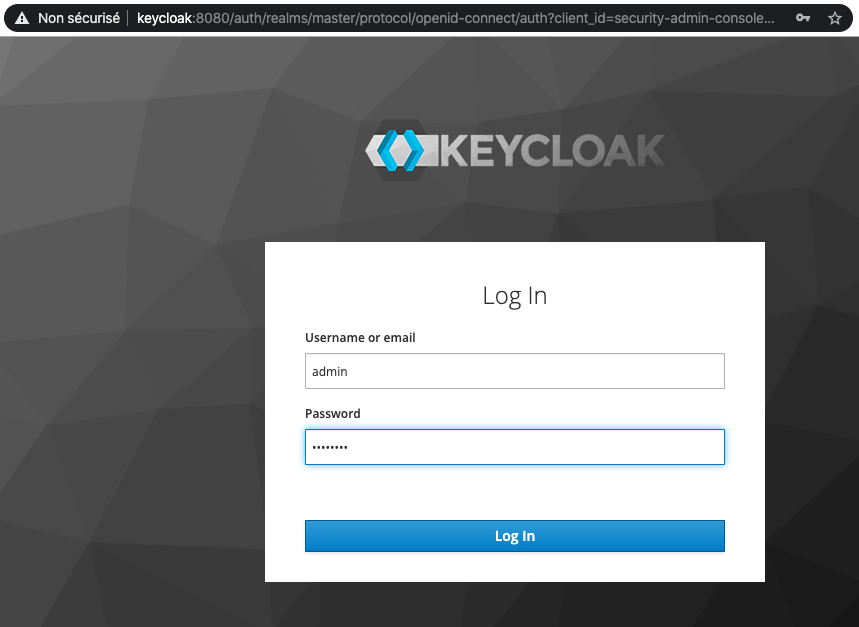
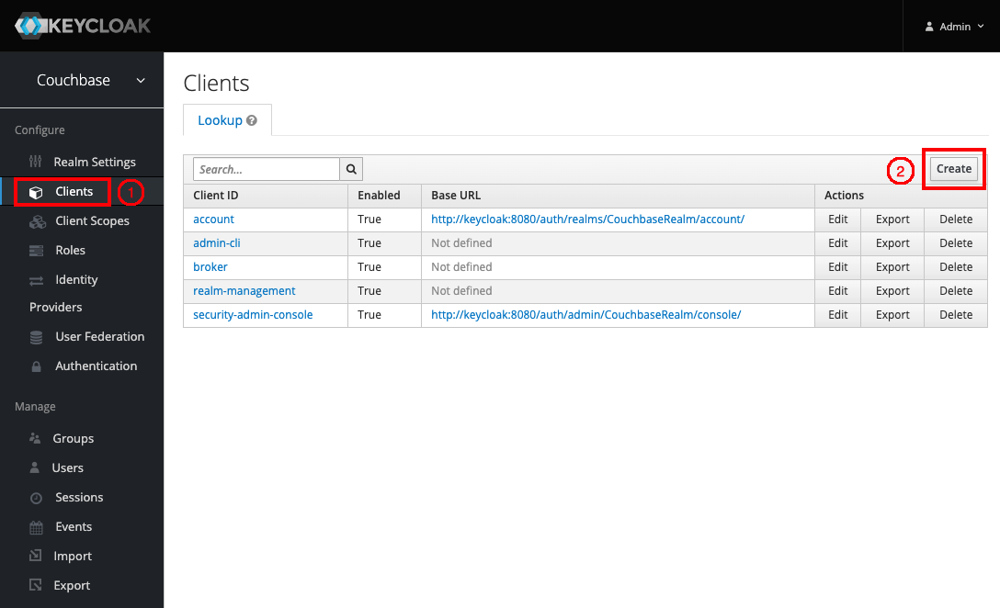
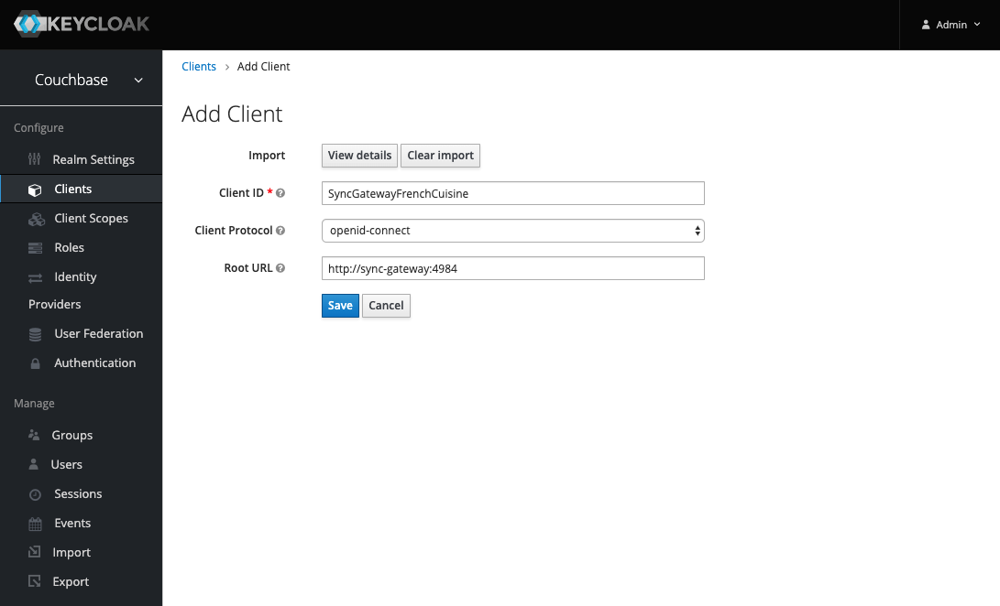
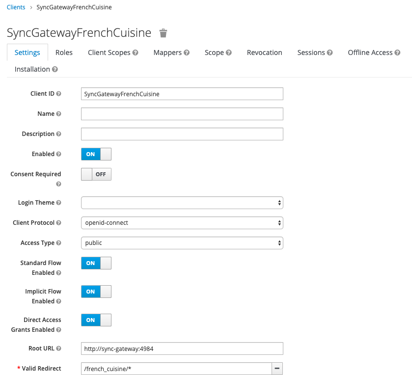
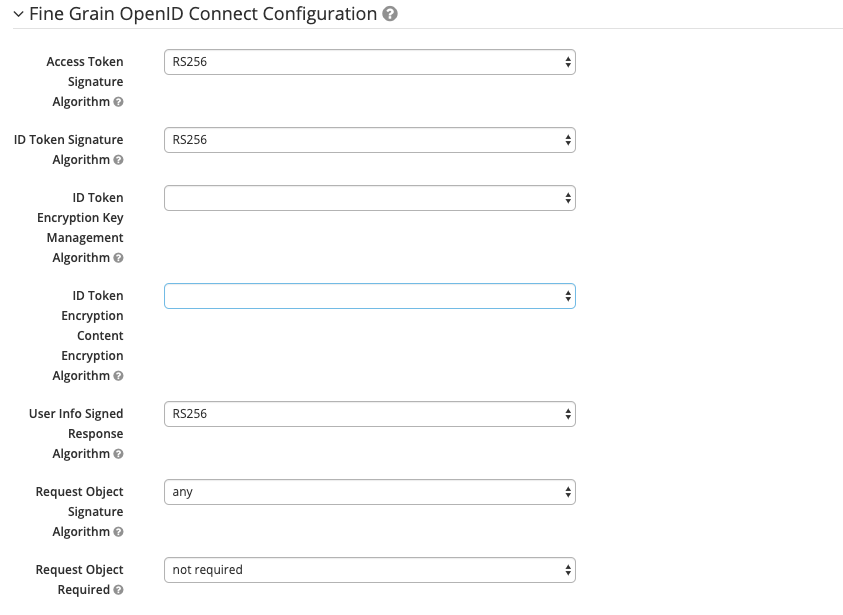
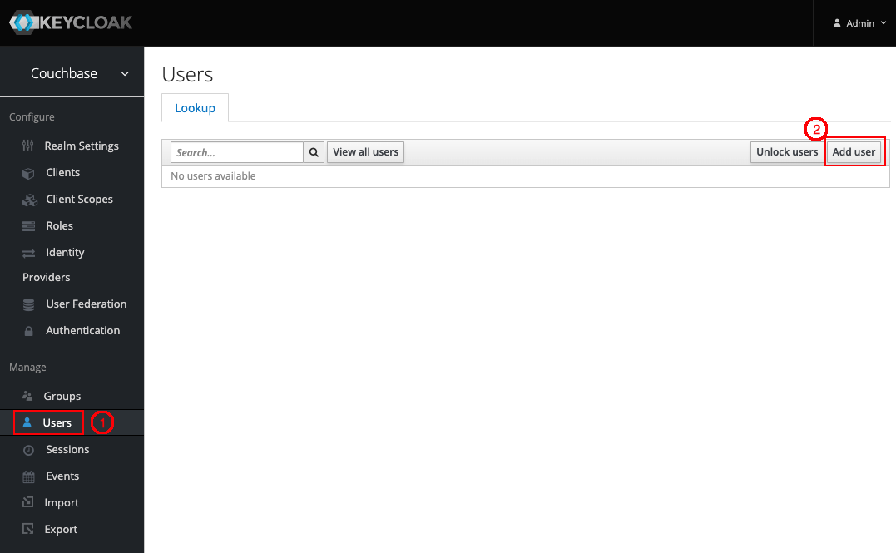
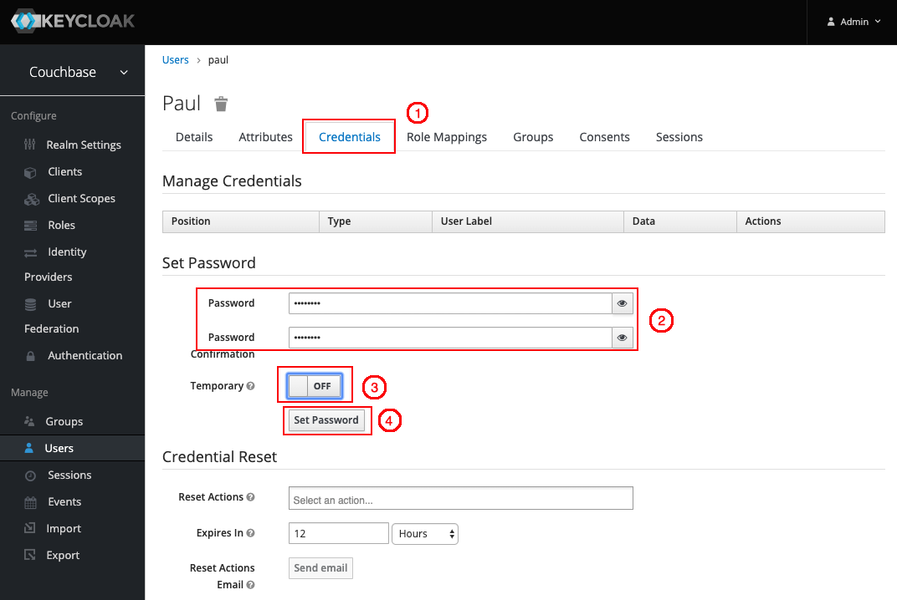
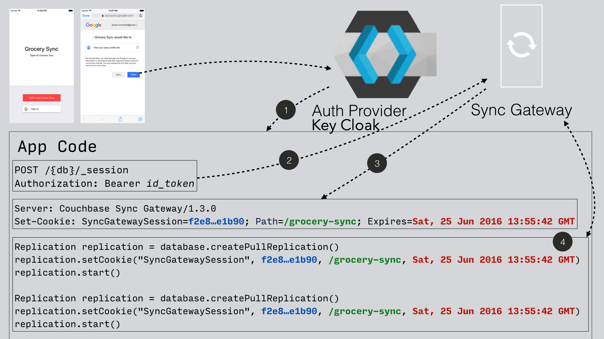
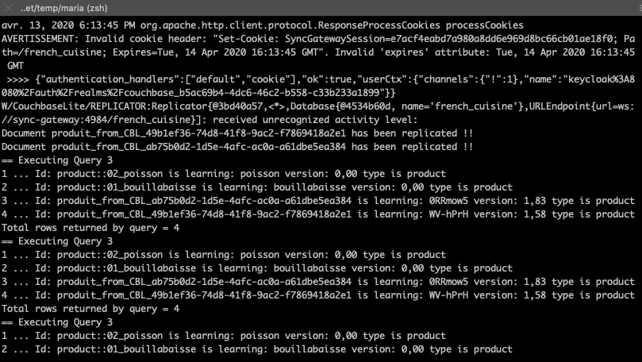

---
# frontmatter
path: "/tutorial-syncgateway-openid-auth"
title: OpenID Connect Authentication for Sync Gateway with Keycloak
short_title: Sync Gateway Authentication
description: 
  - Learn about Sync Gateway's support for OpenID Connect and configure Keycloak and OIDC to work with Sync Gateway
  - View architecture diagrams detailing each component and its role in this authentication system
content_type: tutorial
filter: mobile
technology: 
  - mobile
  - sync gateway
landing_page: none 
landing_order: 15 
tags:
  - Authentication
  - OpenID
  - Keycloak
sdk_language:
  - swift
  - objective-c
  - csharp
  - android-java
length: 30 Mins
---

# Set up an OpenID Connect authentication for the Sync Gateway

## Introduction

Sync Gateway supports OpenID Connect. This allows your application to use Couchbase for data synchronization and delegate the authentication to a 3rd party server known as the OpenID Connect Provider (OP), [See Here](https://docs.couchbase.com/sync-gateway/current/authentication.html#openid-connect)

The goal of this tutorial is to set up and configure the different components participating in this authentication process:

**1**. a client : a Java App using, among other libraries, the Mobile CB-Lite Java SDK 2.7.0,

**2**. an OIDC Service Provider (OP) : Keycloak,

**3**. an OIDC Service Consumer (OC) : Sync Gateway, receiving users credentials from OP and in charge for the authorization part,

**4**. Couchbase Server storing data and the users profiles (`__sync:user:KEYCLOAKID_` records) .

## Role of the OpenID Connect Service Provider

Keycloak ([see](https://www.keycloak.org/)) has been chosen as the OP for this tutorial as it is well-known open-source, free and Red hat supported component. It is an open source identity and access management solution that can obviously do more than offering an OIDC Service Provider : it can also perform Identify federation, SSO, support other protocols like SAML,...
For more information, [see](https://www.keycloak.org/docs/latest/getting_started/index.html)

In the context of this tutorial, two Keycloak (KC) features will be used:

**1**. KC OpenID Connect Service Provider

**2**. KC Identity Service Provider (using built-in KC users database)

## Role of the client

The source code of this tutorial is mainly adapted from the Java CB-Lite "Get Started App' project ([see](https://docs.couchbase.com/couchbase-lite/2.7/java-platform.html#building-a-getting-started-app)). It will perform the retrieval of the ID token and create a user session on the Sync Gateway using the POST /{db}/_session endpoint on the Public REST API with the ID token.

This **GettingStartedWithOpenIDConnect** app demonstrates how to :

**1**. Set up an OIDC authentication workflow with Keycloak using the Implicit Flow method

**2**. Use basic functionality of Couchbase Lite Java (replication and use of different channels).

## Role of the Sync Gateway

With the implicit workflow method, the Sync Gateway will _only_ validate the token, based on the provider definition ([see attributes defined in](https://docs.couchbase.com/sync-gateway/current/config-properties.html#databases-foo_db-oidc-providers-foo_provider))

## Role of Couchbase Server

As we are using the Sync Gateway, the Couchbase Server cluster will store :

**1**. Some business data (as usual),
**2**. Also some **_user_** documents generated by the Sync Gateway

## Physical architecture

Keycloak, Sync Gateway and Couchbase Server components will be deployed as Docker containers.

At the opposite, the App client will be compiled and run locally on your machine: it will always you to run it with different options and, as a developer, to be open in Eclipse if you wish to.


Docker containers will be named `cb-server`, `sync-gateway` and `keycloak` : they will share a common bridge network named "workshop2". As a consequence, they can reach each other based on their name.

From the host (local machine) point-of-view, ports to those applications will be exposed and forwarded (using those same ports) to the host machine.

Nevertheless those names are unknown from that host machine and should therefore be added inside the `/etc/hosts` file of your local machine.

Declare those entries in your `/etc/hosts` file:

```bash
vi /etc/hosts

# edit /etc/hosts by mapping those names to localhost
127.0.0.1 localhost _machineName_ cb-server sync-gateway keycloak
#  note : "_machineName_" is your specific machine name (do not change it)
```

## Deployment

Three docker containers wil be deployed :

**1**. one one-node Couchbase Server 6.5 instance named `cb-server`
**2**. one Sync Gateway 2.7.2 instance named `sync-gateway`
**3**. one Keycloak instance named keycloak`

### Pre requisites

**1**. All the resources files and Java App source code are available inside the `OpenID_connect_tutorial` repository. Open a terminal (TERM1), select a folder to host the git repository and clone the repository:

```bash
git clone https://github.com/couchbaselabs/OpenID_connect_tutorial/
```

The repository structure should look like:

[width=80%](/tutorials/tutorial-syncgateway-openid-auth/repo_folder_content.png)

**2**. As the tutorial is using Docker containers, Docker version 2.2.0.4 or above is supposed to be installed on your machine.

**3**. The Java Project (client part) will be running on your local machine and requires maven 3.6.3 or above to be installed ([see](https://maven.apache.org/install.html)).

**4**. Finally, basic operations like cluster/bucket creation are assumed to be known:

**5**. [Cluster creation](https://docs.couchbase.com/server/current/manage/manage-nodes/create-cluster.html#provision-a-node-with-the-ui)

**6**. [Bucket creation](https://docs.couchbase.com/server/current/manage/manage-buckets/create-bucket.html)

**7**. [Import data using the cbimport` command line tool](https://docs.couchbase.com/server/current/tools/cbimport-json.html)

#### Create a docker network

A bridge network named `workshop2 will be used across all the docker containers.

```bash
docker network create -d bridge workshop2
```

#### Deploy Keycloak

By default KC console log will be appended to inside this dedicated terminal.

Open a **_new_** Bash terminal (TERM2) and run the following docker command:

```bash
docker run -p "8080:8080" --name keycloak --network workshop2 -e KEYCLOAK_USER=admin -e KEYCLOAK_PASSWORD=password jboss/keycloak
```

KC is completely started when the logs end up with:

```bash
11:32:00,618 INFO  [org.wildfly.extension.undertow] (ServerService Thread Pool -- 67) WFLYUT0021: Registered web context: '/auth' for server 'default-server'
11:32:01,056 INFO  [org.jboss.as.server] (ServerService Thread Pool -- 46) WFLYSRV0010: Deployed "keycloak-server.war" (runtime-name : "keycloak-server.war")
11:32:01,273 INFO  [org.jboss.as.server] (Controller Boot Thread) WFLYSRV0212: Resuming server
11:32:01,286 INFO  [org.jboss.as] (Controller Boot Thread) WFLYSRV0060: Http management interface listening on http://127.0.0.1:9990/management
11:32:01,287 INFO  [org.jboss.as] (Controller Boot Thread) WFLYSRV0051: Admin console listening on http://127.0.0.1:9990
11:32:01,288 INFO  [org.jboss.as] (Controller Boot Thread) WFLYSRV0025: Keycloak 8.0.2 (WildFly Core 10.0.3.Final) started in 65894ms - Started 683 of 988 services (701 services are lazy, passive or on-demand)
```

Leave this TERM2 terminal open for log inspection.

#### Deploy Couchbase Server 6.5

**1**. Go back to the _first_ Bash terminal (TERM1) and run the following docker command:

```bash
docker run -d --name cb-server --network workshop2 -p 8091-8094:8091-8094 -p 11210:11210 couchbase/server-sandbox:6.5.0
```

**2**. Once the container is running, using the Couchbase UI or CLI, create a 1-node cluster with data/query/index services enabled.

**3**. Then create a Couchbase bucket named **french_cuisine** (no replica needed) with 100 Mo Memory Quota.


**4**. Next operation is to populate the `french_cuisine` bucket with some data from the `dataset.txt` file.

**5**. Get your `containerID` and copy the `dataset.txt` file in the `/opt/couchbase/bin` folder of the Couchbase Server container.

```bash
docker ps # retrieve the container ID _yourContainerID_ value associated to Couchbase Server

cd OpenID_connect_tutorial
docker cp resources/dataset.txt _yourContainerID_:/opt/couchbase/bin # replace _yourContainerID_ by the previous value
```

**Note:** in the sample below, **_yourContainerID_** value is **cbd9e10d3962**:


In the same terminal, open a Bash session for your Couchbase docker instance and import data from `resources/dataset.json` inside the `french_cuisine` bucket:

```bash
docker exec -it _yourContainerID_ bash
```

Inside the bash terminal of the container, run the following command:

```bash
/opt/couchbase/bin/cbimport json -g product::%id% -c localhost -u Administrator -p password -b french_cuisine --format lines -d file:///opt/couchbase/bin/dataset.txt
```

After this last operation, the `french_cuisine` bucket is now filled with 7 documents:


**5**. Finally create a dedicated Couchbase Server account to access `french_cuisine` bucket from the Sync Gateway:

* Go to `Security -> Add User`
* Create a Sync Gateway user (i.e. `SG_account`) and choose a password.
* Set the Roles `Administration & Global Roles -> Read-Only Admin` and `french_cuisine -> Application Access`
* Click `Addd User` button


#### Deploy Sync Gateway 2.7.2

**Note:** before deploying the Sync Gateway:

**1**. Ensure previously defined tasks on Couchbase Server tasks are completed.
**2**. Change directory to the `resources` folder containing the Sync Gateway JSON config file and a basic `dataset.txt` JSON file.

```bash
cd resources

docker run -p 4984-4985:4984-4985 --network workshop2 --name sync-gateway -d -v pwd/SG_sync-gateway-config-french-cuisine.json:/etc/sync_gateway/sync_gateway.json couchbase/sync-gateway:2.7.2-enterprise -adminInterface :4985 /etc/sync_gateway/sync_gateway.json
```

**3**. Sync Gateway logs can be directly accessed from the local TERM1 using the following command:

```bash
docker logs -f sync-gateway
```

At that point 2 local Bash terminals have been used:

**1**. TERM1 is the terminal with KC running and displaying console logs

**2**. TERM2 is the terminal used for :

**3**. creating the `workshop2` network,

**4**. running the Couchbase Server container,

**5**. running the Sync Gateway container.

### Deploy the client App

**1**. In TERM1, go back to the `Hello_OpenID_Connect` folder and compile the executable jar file.

```bash
cd ../Hello_OpenID_Connect

mvn package
```

**Note 1:** By design, the jar file embeds all the necessary dependencies libraries.

**2**. Run the client, the help menu should appear:

```bash
cd targets

java -jar Hello_openID_connect-1.0.0.jar
```


**Note 2:** For deploying the current project inside Eclipse, at the `Hello_OpenID_Connect` folder level, run the following command to create the `.project` and `.classpath files to be used by Eclipse:

```bash
mvn eclipse:eclipse
```

## Configurations & explanations

### Keycloak side

**1**. Once KC is started, open your browser to the [http://keycloak:8080/auth/admin](http://keycloak:8080/auth/admin).

**2**.  Enter the KC admin credentials: `admin` / `password`.

**Note:** Those credentials were already defined while running the container ( `-e KEYCLOAK_USER=admin -e KEYCLOAK_PASSWORD=password` environment values)



**3**. Realm creation

Once logged in, we need to create a _Keycloak realm_: a realm manages a set of users, credentials, roles, and groups. A user belongs to and logs into a realm. Realms are isolated from one another and can only manage and authenticate the users that they control.

Create a dedicated realm, for example `couchbase` and click on the `Create` button:


**Note** : do not use capital letters inside the `realm` name, nor the `'realm'` term.

The realm is then created:

![KC Create Realm(./kc_create_realm2.png)

**4**. Client creation

Once the realm is built, we then need to create the `SyncGatewayFrenchCuisine` client inside this realm.

On the left tab, click on `Clients` and then on the `Create` button:



Import the `KC_SyncGatewayFrenchCuisine.json` file (located in the `resources` folder) inside KC using the `Select file` button.

The updated client configuration is now:



Click `Save`

KC switches to the updated client view. Check the following configuration options are properly set:






**Note:** all other properties can remain unchanged.

**5**. Users creation

KC can connect to various sources via User Federation (LDAP and Kerberos) but also offers built-in storage for users and roles  ([see here](https://www.keycloak.org/docs/latest/server_installation/#_database)). In this tutorial, we will be using this KC built-in storage. Please refer to the KC documentation for other User Federation technics ([see here](https://www.keycloak.org/docs/6.0/server_admin/#_user-storage-federation)).

On the left tab, click on `Users` and `Add user`



Fill in the form for `paul` user:


* Click the `Save` button.
* Then set the password `password` for `paul` user by:
* clicking on `Credentials`,
* entering paul's password twice (i.e. `password`),
* un-checking the `Temporary` checkbox
* finally clicking on `Set Password` and confirm by clicking on `Set password` inside the validation dialog box.



Repeat these same steps for creating the following users:

* `wolfgang`
* `maria`
* `emmanuel`

At the end, by clicking on `View all users`, the users table should look like this:


#### Sync Gateway side

While deploying the Sync Gateway, a reference to the `SG_sync-gateway-config-french-cuisine.json` JSON configuration file was made. Let see what this document contains:

```yml
{
  "interface":":4984",
  "log": ["*"],
  "logging": { <1>
    "log_file_path": "/var/tmp/sglogs",
    "console": {
      "log_level": "debug",
      "log_keys": ["*"]
    },
    "error": {
      "enabled": true,
      "rotation": {
        "max_size": 20,
        "max_age": 180
      }
    },
    "warn": {
      "enabled": true,
      "rotation": {
        "max_size": 20,
        "max_age": 90
      }
    },
    "info": {
        "enabled": true,
        "rotation": {
            "max_size": 100,
            "max_age": 6,
            "localtime": false
        }
    },
    "debug": {
        "enabled": false,
        "rotation": {
            "max_size": 100,
            "max_age": 2,
            "localtime": false
        }
    }
  },
  "databases": {
    "french_cuisine": { <2>
      "bucket_op_timeout_ms": 5000,
      "server": "http://cb-server:8091", <3>
      "bucket": "french_cuisine",
      "username": "SG_Account", <4>
      "password": "password", <5>
      "enable_shared_bucket_access": true,
      "import_docs": true,
      "num_index_replicas": 0,
      "roles": { <6>
        "Bretagne_region_role": {
          "admin_channels": [ "Bretagne_region" ]
        },
        "Alsace_region_role": {
          "admin_channels": [ "Alsace_region" ]
        },
        "PACA_region_role": {
          "admin_channels": [ "PACA_region" ]
        },
        "France_role": {
          "admin_channels": [ "Bretagne_region", "Alsace_region", "PACA_region" ]
        }
      },
      "users":{ <7>
          "admin": {"password": "password", "admin_channels": ["*"]}
      },
      "allow_conflicts": true,
      "revs_limit": 20,
      "oidc": { <8>
        "providers": {
          "keycloakimplicit": { <9>
            "issuer":"http://keycloak:8080/auth/realms/couchbase", <10>
            "client_id":"SyncGatewayFrenchCuisine", <11>
            "register": true <12>
          }
        }
      },
      "sync": `function (doc, oldDoc) { <13>
        console.log("ENTERING sync function...");

        if (doc.channels) {
          console.log("doc.channels = " + doc.channels);
          channel(doc.channels);
       }

       console.log("QUITING sync function.");
      }`
    }
  }
}
```

**1**. Some logging configuration.

**2**. The database named `french_cuisine` (could be different from the bucket name).

**3**. The Couchbase Server node

**4**. The Sync Gateway account previously created to access `french_cuisine` bucket from the Sync Gateway.

**5**. The Sync Gateway password previously created to access `french_cuisine` bucket from the Sync Gateway.

**6**. The roles definition: one channel per region is created.

**7**. The users definition: by default, the `admin` user is created here, accessing all channels.

**8**. The OpenID Connect configuration section.

**9**. A `keycloakimplicit` provider is defined  (this dummy variable could be replaced by anything else)

**10**. The OpenID Connect Service Provider issuer (Keycloak URL endpoint, see previous section).

**11**. The `client_id` is defined at OP level (see previous section)

**12**. Allow any successful logged-in user in KC to automatically create the equivalent user inside Sync Gateway. Note: define users inside the Sync Gateway does not automatically grant access to any channel.

**13**. The sync function ([see here](https://docs.couchbase.com/sync-gateway/current/config-properties.html#databases-foo_db-sync)) is filtering on `doc.channels` property. Only those documents are **_channeled_** ([see here](https://docs.couchbase.com/sync-gateway/current/sync-gateway-channels.html#add-to-channel)) to the corresponding channels.

#### Java App code side

With the OIDC implicit method, the client-side is in charge of getting the token from the OP and give it to the Sync Gateway.

The authorization workflow can be represented as follows:



[See Here](https://docs.couchbase.com/sync-gateway/current/authentication.html#openid-connect)

A) Global Overview

Here are the method calls to leverage an OpenID Connect authentication for the Sync Gateway.

`main` method inside the `GettingStartedWithOpenIDConnect` class:

```java
. . .

// =======================================
// Add OpenID Connect authentication here.
// =======================================

// get the id_token from user credentials
String tokenID = OpenIDConnectHelper.getTokenID(user, password); <1>
// create session storing the id_token (at SG level)
// and save the sessionID inside a cookie
Cookie cookie = OpenIDConnectHelper.createSessionCookie(tokenID); <2>

replConfig.setAuthenticator(new SessionAuthenticator(cookie.getValue(), StringConstants.SG_COOKIE_NAME)); <3>

. . .
```

**1**. The client obtains a signed Open ID token directly from an OpenID Connect provider.

**2**. The client pushes the Open ID token to the Sync Gateway to have it store in session. In response, a cookie containing the sessionID is returned by the Sync Gateway.

**3**. Subsequent calls will be authorized based on this sessionID.

Now let's explain the role of these 2 static methods.

**Note: The OIDC Authentication with Implicit Flow logic is coded in the `OpenIDConnectHelper.java` file.**

**Hereafter are some extracted methods from this file.**

B) Get the Open ID token

Static method `String getTokenID(String dbUser, String dbPass)`:

```java
/**
  * Compute tokenID from DBUSER / DBPASS
  * 
  * @param dbUser
  * @param dbPass
  * @return
  */
public static String getTokenID(String dbUser, String dbPass) {

  HttpResponse<String> response1 = Unirest.get(KC_OIDC_AUTH_URL).header("accept", "application/json") <1>
      .queryString("response_type", "id_token").queryString("client_id", "SyncGatewayFrenchCuisine")
      .queryString("scope", "openid,id_token").queryString("redirect_uri", SG_DB_URL)
      .queryString("nonce", StringConstants.NONCE).queryString("state", StringConstants.STATE).asString();

  // retrieve the POST method inside the returned fiorm
  URL postURL = extractPostURL(response1.getBody());

  String basePostURL = postURL.toString().split("\\?")[0];
  System.out.println("basePostURL = " + basePostURL);

  // Parse the queryString into Name-Value map
  Map<String, Object> mapQueryString = null;
  try {
    mapQueryString = splitQuery(postURL);
  } catch (UnsupportedEncodingException e) {
    System.err.println(e);
    ;
  }

  // Run the Authentication POST request with the given username/password to
  // obtain the id_token.
  HttpResponse<String> response2 = Unirest.post(basePostURL).header("accept", "application/json") <2>
      .queryString(mapQueryString).field("username", dbUser).field("password", dbPass).asString();

  // get the id_token
  List<String> locationHeaderList = response2.getHeaders().get(StringConstants.LOCATION_HEADER_NAME);
  if (locationHeaderList == null) {
    throw new IllegalArgumentException("locationHeaderList is null");
  }

  String locationHeader = locationHeaderList.get(0);

  if (locationHeader == null) {
    throw new IllegalArgumentException("locationHeader is null");
  }

  URL urlWithToken = null;
  try {
    urlWithToken = new URL(locationHeader);
  } catch (MalformedURLException e) {
    System.err.println(e);
  }

  Map<String, Object> refParams = splitRef(urlWithToken);

  String idTokenValue = (String) refParams.get("id_token");
  if (idTokenValue == null) {
    throw new IllegalArgumentException("id_token is missing");
  }

  return idTokenValue;
}
```

The client code sends:

**1**. a **first GET request** to Keycloak endpoint `KC_OIDC_AUTH_URL = http://keycloak:8080/auth/realms/couchbase/protocol/openid-connect/auth/` adding `client_id = SyncGatewayFrenchCuisine` and `response_type = id_token` as query string parameters. The KC response is a login form.

**2**. a **second POST request** to KC (extracting the URL from the `action form) with the user credentials and, if successful, KC returns an Open ID token back to the application.

By design, this code **_silently_** gets the Open ID token from KC in 2 steps.

* the code extracts the POST URL from the HTML response (from the first request)
* then it does a POST on this second URL (`http://keycloak:8080/auth/realms/couchbase/login-actions/authenticate?session_code=..`) in order to obtain the Open ID token inside the `id_token` response header.

**Note:** as oppose to this _silent_ option, another option _could_ have been to run the **first request** in a web-browser to expose the KC UI login screen directly to the end-user and then let the user enters his login/password and submits the form and perform the **second request**: the Open ID token would be contained in the `id_token` response header as well.

C) Create a session ID from the Open ID token

Static method `Cookie createSessionCookie(String idTokenValue)`:

```java

public static Cookie createSessionCookie(String idTokenValue) {

  HttpResponse<String> response3 = Unirest.post("http://sync-gateway:4984/french_cuisine/_session") <1>
      .header("Authorization", "Bearer " + idTokenValue).asString();

  System.out.println(" >>>> " + response3.getBody());

  Iterator<Cookie> it = response3.getCookies().iterator(); 
  Cookie resCookie = null;

  while (it.hasNext()) {
    Cookie cookie = it.next();
    if (StringConstants.SG_COOKIE_NAME.equals(cookie.getName())) {
      resCookie = cookie; <2>
      break;
    }
  }

  return resCookie;
}
```

* The ID token is used to create a Sync Gateway session by sending a POST `/{db}/_session` request by including the Open ID token as an `Authorization: Bearer <id_token>` inside the request header.
* Sync Gateway returns a cookie session in the response header (to be used after inside the `SessionAuthenticator` on the replicator object).

## Tests

The tests are mainly focusing on:

* establishing a connection to the Keycloak OP
* give the right access (the right channel) to each  user
* how to use channels to filter results based on different channel roles.

### Test 1 : basic test for a 1-user synchronization

**1**. Note that, inside the code both the `SYNC_GATEWAY_URL` and Keycloak authentication URL (`KC_OIDC_AUTH_URL`) are **hard-coded**:

`SYNC_GATEWAY_URL` :

* http version : `http://sync-gateway:4984/french_cuisine/`
* websocket version : `ws://sync-gateway:4984/french_cuisine`

`KC_OIDC_AUTH_URL` : `http://keycloak:8080/auth/realms/couchbase/protocol/openid-connect/auth/`

**2**. Run the java client App :

```bash
/eclipse-workspace/HelloWorldCBLite2.7/Hello_OpenID_Connect/target(master*) » java -jar Hello_openID_connect-1.0.0.jar -u paul -p password
DB_PATH = /Users/fabriceleray/eclipse-workspace/HelloWorldCBLite2.7/Hello_OpenID_Connect/target/resources
W/CouchbaseLite/DATABASE:Database.log.getFile().getConfig() is now null: logging is disabled.  Log files required for product support are not being generated.
== Executing Query 1
Query returned 0 rows of type product
basePostURL = http://keycloak:8080/auth/realms/couchbase/login-actions/authenticate
avr. 13, 2020 4:30:29 PM org.apache.http.client.protocol.ResponseProcessCookies processCookies
AVERTISSEMENT: Invalid cookie header: "Set-Cookie: SyncGatewaySession=b098ac3426f20bfb3e5fe6eb65fa80174e7eeb43; Path=/french_cuisine; Expires=Tue, 14 Apr 2020 14:30:29 GMT". Invalid 'expires' attribute: Tue, 14 Apr 2020 14:30:29 GMT
 >>>> {"authentication_handlers":["default","cookie"],"ok":true,"userCtx":{"channels":{"!":1},"name":"keycloak%3A8080%2Fauth%2Frealms%2Fcouchbase_05b2ad6c-598d-44a5-9eca-4b8b671cd84c"}}
W/CouchbaseLite/REPLICATOR:Replicator{@17c386de,<*>,Database{@4534b60d, name='french_cuisine'},URLEndpoint{url=ws://sync-gateway:4984/french_cuisine}]: received unrecognized activity level:
== Executing Query 3
Total rows returned by query = 0
== Executing Query 3
Total rows returned by query = 0
^C%

~/eclipse-workspace/HelloWorldCBLite2.7/Hello_OpenID_Connect/target(master*) »
```

**3**. **Note** that:

The replication process has run successfully : a `/resources/` folder containing `french_cuisine.cblite2` file have been created:

```bash
~/eclipse-workspace/HelloWorldCBLite2.7/Hello_OpenID_Connect/target(master*) » ll resources
total 0
drwxr-xr-x  2 fabriceleray  staff    64B 13 avr 16:31 CouchbaseLiteTemp
drwx------  6 fabriceleray  staff   192B 13 avr 16:31 french_cuisine.cblite2

~/eclipse-workspace/HelloWorldCBLite2.7/Hello_OpenID_Connect/target(master*) »
```

no data has been replicated to the local database (`Total rows returned by query = 0`). **Why that?**

This is because, despite the `authentication` process was successful, the `authorization` process is still handled by the Sync Gateway. At that point, `paul` user is _not_ linked to any channels.

To check this thing, open Couchbase Server `Documents` tab and search for `\_sync:user:keycloak_PAUL_ID_`:


The `keycloak userID` linked to `paul` user has to be given access to the channels he should belong to, that is to say : paul should be granted access to channel role `Bretagne_region_role`.

To perform such operation, we need to change paul's channel access role ([see here](https://docs.couchbase.com/sync-gateway/current/users-and-roles.html) and [here](https://docs.couchbase.com/sync-gateway/current/admin-rest-api.html#/user/put__db___user__name_)).

Run the following curl command (adapting the `keycloak userID` value to yours) to change paul's role channel settings:

```bash
curl -X PUT "http://localhost:4985/french_cuisine/_user/keycloak%3A8080%2Fauth%2Frealms%2Fcouchbase_05b2ad6c-598d-44a5-9eca-4b8b671cd84c" -H "accept: application/json" -H "Content-Type: application/json" -d "{ \"name\": \"keycloak%3A8080%2Fauth%2Frealms%2Fcouchbase_05b2ad6c-598d-44a5-9eca-4b8b671cd84c\", \"password\": \"password\", \"admin_roles\": [ \"Bretagne_region_role\" ], \"email\": \"paul@paul.com\", \"disabled\": false}"
```

Refresh your Couchbase Sever Document page in your browser and check again `\_sync:user:keycloak_PAUL_ID_`. Paul's channel roles have changed:


**Note**: of course, it is also possible to directly create users with associated `admin_roles` _before_ user first log in attempt using POST REST calls ([see here](https://docs.couchbase.com/sync-gateway/2.7/admin-rest-api.html#/user/post__db___user_)).

**4**. Re-run the java client App:

```bash
~/eclipse-workspace/HelloWorldCBLite2.7/Hello_OpenID_Connect/target(master*) » rm -f resources # to be sure to restart from a fresh local database
~/eclipse-workspace/HelloWorldCBLite2.7/Hello_OpenID_Connect/target(master*) » java -jar Hello_openID_connect-1.0.0.jar -u paul -p password
DB_PATH = /Users/fabriceleray/eclipse-workspace/HelloWorldCBLite2.7/Hello_OpenID_Connect/target/resources
W/CouchbaseLite/DATABASE:Database.log.getFile().getConfig() is now null: logging is disabled.  Log files required for product support are not being generated.
== Executing Query 1
Query returned 0 rows of type product
basePostURL = http://keycloak:8080/auth/realms/couchbase/login-actions/authenticate
avr. 13, 2020 5:06:57 PM org.apache.http.client.protocol.ResponseProcessCookies processCookies
AVERTISSEMENT: Invalid cookie header: "Set-Cookie: SyncGatewaySession=018241ac94b0c92b70fb1e31ce9538e21581a034; Path=/french_cuisine; Expires=Tue, 14 Apr 2020 15:06:57 GMT". Invalid 'expires' attribute: Tue, 14 Apr 2020 15:06:57 GMT
 >>>> {"authentication_handlers":["default","cookie"],"ok":true,"userCtx":{"channels":{"!":1},"name":"keycloak%3A8080%2Fauth%2Frealms%2Fcouchbase_05b2ad6c-598d-44a5-9eca-4b8b671cd84c"}}
W/CouchbaseLite/REPLICATOR:Replicator{@17c386de,<*>,Database{@4534b60d, name='french_cuisine'},URLEndpoint{url=ws://sync-gateway:4984/french_cuisine}]: received unrecognized activity level:
Document product::05_galette has been replicated !!
Document product::06_saucisse has been replicated !!
== Executing Query 3
1 ... Id: product::05_galette is learning: galette version: 0,00 type is product
2 ... Id: product::06_saucisse is learning: saucisse version: 0,00 type is product
Total rows returned by query = 2
== Executing Query 3
1 ... Id: product::05_galette is learning: galette version: 0,00 type is product
2 ... Id: product::06_saucisse is learning: saucisse version: 0,00 type is product
Total rows returned by query = 2
^C%
~/eclipse-workspace/HelloWorldCBLite2.7/Hello_OpenID_Connect/target(master*) »
```

Now the replication is done for Paul for documents whose channels are belonging to `Bretagne_region_role` role:

```yml
 "Bretagne_region_role": {
          "admin_channels": [ "Bretagne_region" ]
        },
```

As documents `product::05_galette` and `product::06_saucisse` are associated to the `Bretagne_region` channel, they are successfully replicated to paul's local database.

**5**. Stop the process (`Ctrl+C`) and  re-run the executable adding one more document to the local database (adding optional arguments `-d 1 -c Bretagne_region` to the previous command line):

```bash
~/eclipse-workspace/HelloWorldCBLite2.7/Hello_OpenID_Connect/target(master*) » java -jar Hello_openID_connect-1.0.0.jar -u paul -p password -d 1 -c Bretagne_region
Option create-doc is present.  The value is: 1
Option channel is present.  The value is: Bretagne_region
DB_PATH = /Users/fabriceleray/eclipse-workspace/HelloWorldCBLite2.7/Hello_OpenID_Connect/target/resources
W/CouchbaseLite/DATABASE:Database.log.getFile().getConfig() is now null: logging is disabled.  Log files required for product support are not being generated.
Document ID is :: produit_from_CBL_f9fb9e1e-7681-4d0f-8a77-dbefc62457bc
Name 22mdufI
Price 1.5558478281279886
Channels Bretagne_region
== Executing Query 1
Query returned 3 rows of type product
basePostURL = http://keycloak:8080/auth/realms/couchbase/login-actions/authenticate
avr. 13, 2020 5:28:06 PM org.apache.http.client.protocol.ResponseProcessCookies processCookies
AVERTISSEMENT: Invalid cookie header: "Set-Cookie: SyncGatewaySession=2779cfba9ecf72755bc290daeceddd27267e18d6; Path=/french_cuisine; Expires=Tue, 14 Apr 2020 15:28:06 GMT". Invalid 'expires' attribute: Tue, 14 Apr 2020 15:28:06 GMT
 >>>> {"authentication_handlers":["default","cookie"],"ok":true,"userCtx":{"channels":{"!":1},"name":"keycloak%3A8080%2Fauth%2Frealms%2Fcouchbase_05b2ad6c-598d-44a5-9eca-4b8b671cd84c"}}
W/CouchbaseLite/REPLICATOR:Replicator{@3bd40a57,<*>,Database{@4534b60d, name='french_cuisine'},URLEndpoint{url=ws://sync-gateway:4984/french_cuisine}]: received unrecognized activity level:
Document produit_from_CBL_f9fb9e1e-7681-4d0f-8a77-dbefc62457bc has been replicated !!
== Executing Query 3
1 ... Id: product::05_galette is learning: galette version: 0,00 type is product
2 ... Id: product::06_saucisse is learning: saucisse version: 0,00 type is product
3 ... Id: produit_from_CBL_f9fb9e1e-7681-4d0f-8a77-dbefc62457bc is learning: 22mdufI version: 1,56 type is product
Total rows returned by query = 3
^C%
~/eclipse-workspace/HelloWorldCBLite2.7/Hello_OpenID_Connect/target(master*) »
```

**6**. Check the document `produit_from_CBL_f9fb9e1e-7681-4d0f-8a77-dbefc62457bc` (adapt to your productID) has been replicated to Couchbase Server:


#### Test 2 : advanced test with 4 users

The goal here is to test channel's filtering. Each user is linked to 1 channel except for `emmanuel` whose role is `France_role` and is therefore linked to the 3 channels.

**1**. In the `target` folder, create a `temp` directory and 4 subdirectories named `paul`, `wolfgang`, `maria` and `emmanuel`.

**2**. Create 4 copies of the target directory inside those folders:

```bash
mkdir -p temp/paul
mkdir -p temp/wolfgang
mkdir -p temp/maria
mkdir -p temp/emmanuel

cp Hello_openID_connect-1.0.0.jar temp/paul
cp Hello_openID_connect-1.0.0.jar temp/wolfgang
cp Hello_openID_connect-1.0.0.jar temp/maria
cp Hello_openID_connect-1.0.0.jar temp/emmanuel
```

**3**. Open 4 terminals (TERM1, TERM2, TERM3 and TERM4) and `cd` to the corresponding folders above and run the client App once for each user.

```bash
TERM1:
java -jar Hello_openID_connect-1.0.0.jar -u paul -p password

TERM2:
java -jar Hello_openID_connect-1.0.0.jar -u wolfgang -p password

TERM3:
java -jar Hello_openID_connect-1.0.0.jar -u maria -p password

TERM4:
java -jar Hello_openID_connect-1.0.0.jar -u emmanuel -p password
```

**4**. Note that:

In Couchbase Server, each user has now his `__sync:user:KEYCLOAKID_` document.
No document is replicated (except for `paul` because his channel role was defined during `Test 1`)

**5**. Change channels to `wolfgang`, `maria` and `emmanuel`. In any terminal, run the following curl commands:

```bash
curl -X PUT "http://localhost:4985/french_cuisine/_user/keycloak%3A8080%2Fauth%2Frealms%2Fcouchbase_e014924e-4b4b-4b48-b772-c79140e4da31" -H "accept: application/json" -H "Content-Type: application/json" -d "{ \"name\": \"keycloak%3A8080%2Fauth%2Frealms%2Fcouchbase_e014924e-4b4b-4b48-b772-c79140e4da31\", \"password\": \"password\", \"admin_roles\": [ \"Alsace_region_role\" ], \"email\": \"wolfgang@wolfgang.com\", \"disabled\": false}"

curl -X PUT "http://localhost:4985/french_cuisine/_user/keycloak%3A8080%2Fauth%2Frealms%2Fcouchbase_b5ac69b4-4dc6-46c2-b558-c33b233a1899" -H "accept: application/json" -H "Content-Type: application/json" -d "{ \"name\": \"keycloak%3A8080%2Fauth%2Frealms%2Fcouchbase_b5ac69b4-4dc6-46c2-b558-c33b233a1899\", \"password\": \"password\", \"admin_roles\": [ \"PACA_region_role\" ], \"email\": \"maria@maria.com\", \"disabled\": false}"

curl -X PUT "http://localhost:4985/french_cuisine/_user/keycloak%3A8080%2Fauth%2Frealms%2Fcouchbase_f7715f9c-fa3b-49c6-b442-00df719a2402" -H "accept: application/json" -H "Content-Type: application/json" -d "{ \"name\": \"keycloak%3A8080%2Fauth%2Frealms%2Fcouchbase_f7715f9c-fa3b-49c6-b442-00df719a2402\", \"password\": \"password\", \"admin_roles\": [ \"France_role\" ], \"email\": \"emmanuel@emmanuel.com\", \"disabled\": false}"
```

Check the channel's role are applied to the users:

Wolfgang:


Maria:


Emmanuel:


**6**. Now re-run the java client App and observe the differences:

Paul:


Wolfgang:


Maria:


Emmanuel:


**7**. As expected, adding 2 new products for `PACA_region` makes some change in `maria` and `emmanuel` results.

```bash
java -jar Hello_openID_connect-1.0.0.jar -u maria -p password -d 2 -c PACA_region
```

**8**. Check `maria` and `emmanuel` results (results for other users remain unchanged):

Maria:



Emmanuel:


